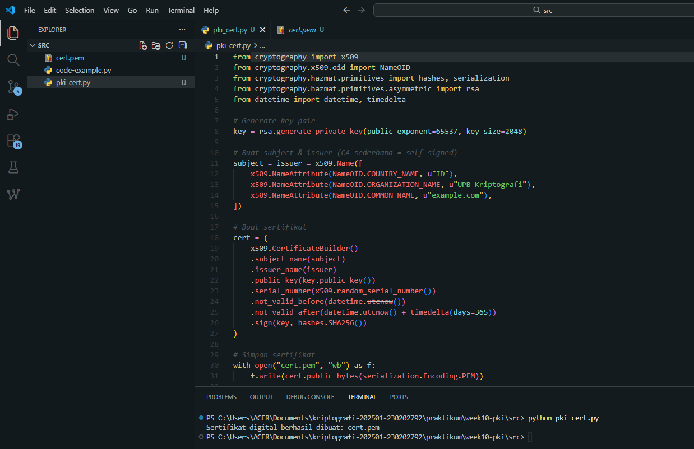

# Laporan Praktikum Kriptografi
Minggu ke-: 10  
Topik: Public Key Infrastructure (PKI & Certificate Authority)  
Nama: Zaki Fauzan Sulton
NIM: 230202792  
Kelas: 5IKRA  

---

## 1. Tujuan
1. Membuat sertifikat digital sederhana.  
2. Menjelaskan peran Certificate Authority (CA) dalam sistem PKI.  
3. Mengevaluasi fungsi PKI dalam komunikasi aman (contoh: HTTPS, TLS).  


---

## 2. Dasar Teori
Public Key Infrastructure (PKI) adalah kerangka kerja yang terdiri dari kebijakan, prosedur, server, dan stasiun kerja yang digunakan untuk mengelola dan memvalidasi sertifikat digital, yang mengikat identitas pengguna dengan pasangan kunci publik/privat mereka. Tujuan utama PKI adalah untuk memungkinkan enkripsi aman dan tanda tangan digital dalam komunikasi, dengan mengatasi masalah kepercayaan mendasar: bagaimana memverifikasi bahwa suatu kunci publik benar-benar milik entitas yang diklaim. PKI melakukan ini dengan mengandalkan sistem terstruktur, di mana komponen utama memastikan bahwa kunci publik didistribusikan secara otentik, dipertahankan secara aman, dan dicabut jika terjadi kompromi.

Komponen sentral dari PKI adalah Certificate Authority (CA), sebuah entitas terpercaya pihak ketiga yang bertanggung jawab untuk mengeluarkan dan mengelola sertifikat digital. Ketika suatu entitas ingin membuktikan identitasnya, ia mengirimkan permintaan penandatanganan sertifikat ($\text{CSR}$) kepada CA. CA memverifikasi identitas pemohon secara ketat, dan jika berhasil, CA menandatangani Kunci Publik pemohon menggunakan kunci privatnya sendiri, menghasilkan Sertifikat Kunci Publik (PKC). PKC ini kemudian berfungsi sebagai "paspor" elektronik yang dijamin oleh CA. Fungsi penting lainnya dari CA adalah mempertahankan Certificate Revocation List (CRL) atau menggunakan protokol OCSP (Online Certificate Status Protocol) untuk memberi tahu publik jika suatu sertifikat telah dikompromikan atau tidak valid lagi.

---

## 3. Alat dan Bahan
(- Python 3.x  
- Visual Studio Code / editor lain  
- Git dan akun GitHub  
- Library tambahan, install cryptography.  )

---

## 4. Langkah Percobaan
(Tuliskan langkah yang dilakukan sesuai instruksi.  

1. Membuat file `pki_cert.py` di folder `praktikum/week10-pki/src/`.
2. Menyalin kode program dari panduan praktikum.
3. Menjalankan program

---

## 5. Source Code
(Salin kode program utama yang dibuat atau dimodifikasi.  
Gunakan blok kode:

```python
from cryptography import x509
from cryptography.x509.oid import NameOID
from cryptography.hazmat.primitives import hashes, serialization
from cryptography.hazmat.primitives.asymmetric import rsa
from datetime import datetime, timedelta

# Generate key pair
key = rsa.generate_private_key(public_exponent=65537, key_size=2048)

# Buat subject & issuer (CA sederhana = self-signed)
subject = issuer = x509.Name([
    x509.NameAttribute(NameOID.COUNTRY_NAME, u"ID"),
    x509.NameAttribute(NameOID.ORGANIZATION_NAME, u"UPB Kriptografi"),
    x509.NameAttribute(NameOID.COMMON_NAME, u"example.com"),
])

# Buat sertifikat
cert = (
    x509.CertificateBuilder()
    .subject_name(subject)
    .issuer_name(issuer)
    .public_key(key.public_key())
    .serial_number(x509.random_serial_number())
    .not_valid_before(datetime.utcnow())
    .not_valid_after(datetime.utcnow() + timedelta(days=365))
    .sign(key, hashes.SHA256())
)

# Simpan sertifikat
with open("cert.pem", "wb") as f:
    f.write(cert.public_bytes(serialization.Encoding.PEM))

print("Sertifikat digital berhasil dibuat: cert.pem")
```
)

---

## 6. Hasil dan Pembahasan
Praktikum ini berhasil menunjukkan proses inti Public Key Infrastructure (PKI) dengan membuat **Self-Signed Certificate** X.509 yang mengikat identitas (`example.com`) dengan Kunci Publik RSA. Keberhasilan pembuatan file `cert.pem` melalui penandatanganan kriptografis oleh kunci privat sendiri membuktikan pemahaman dasar tentang bagaimana Certificate Authority (CA) beroperasi untuk menjamin keabsahan Kunci Publik.

Hasil eksekusi program pki cert:



)

---

## 7. Jawaban Pertanyaan

### 1. Apa fungsi utama Certificate Authority (CA)?
Certificate Authority (CA) berfungsi sebagai **pihak tepercaya** yang menerbitkan, memverifikasi, dan menandatangani **sertifikat digital**. CA memastikan bahwa kunci publik yang terdapat dalam sertifikat benar-benar milik entitas yang mengklaimnya (server, organisasi, atau individu). Dengan adanya CA, pengguna dapat mempercayai identitas server atau layanan dalam komunikasi digital tanpa harus mengenal langsung pemilik kunci publik tersebut.

### 2. Mengapa self-signed certificate tidak cukup untuk sistem produksi?
Self-signed certificate tidak cukup untuk sistem produksi karena **tidak diverifikasi oleh pihak tepercaya**. Sertifikat ini ditandatangani oleh pemiliknya sendiri, sehingga klien (browser atau aplikasi) tidak dapat memastikan keaslian identitas server. Akibatnya, browser akan menampilkan peringatan keamanan dan komunikasi rentan terhadap serangan **Man-in-the-Middle (MITM)**. Self-signed certificate umumnya hanya cocok untuk keperluan **pengujian, pembelajaran, atau lingkungan internal**.

### 3. Bagaimana PKI mencegah serangan MITM dalam komunikasi TLS/HTTPS?
PKI mencegah serangan MITM dengan cara:
- Server menyajikan sertifikat digital yang **ditandatangani oleh CA tepercaya**.
- Klien memverifikasi keabsahan sertifikat (rantai kepercayaan, masa berlaku, dan domain).
- Kunci publik server yang valid digunakan untuk melakukan **pertukaran kunci secara aman**.
- Penyerang tidak dapat memalsukan sertifikat yang valid tanpa kunci privat CA.
  
---

## 8. Kesimpulan
Praktikum ini berhasil menunjukkan proses inti Public Key Infrastructure (PKI) dengan membuat Self-Signed Certificate X.509 yang mengikat identitas (example.com) dengan Kunci Publik RSA. Keberhasilan pembuatan file cert.pem melalui penandatanganan kriptografis oleh kunci privat sendiri membuktikan pemahaman dasar tentang bagaimana Certificate Authority (CA) beroperasi untuk menjamin keabsahan Kunci Publik.

---

## 9. Daftar Pustaka
(Cantumkan referensi yang digunakan.  
Contoh:  
- Katz, J., & Lindell, Y. *Introduction to Modern Cryptography*.  
- Stallings, W. *Cryptography and Network Security*.  )

---

## 10. Commit Log

```
commit f9d2566936631ffaa5006b76e38747ec94394463
Author: Zaki Fauzan Sulton <a47922653@gmail.com>
Date:   Tue Dec 16 14:52:26 2025 +0700

    week10-pki
```
