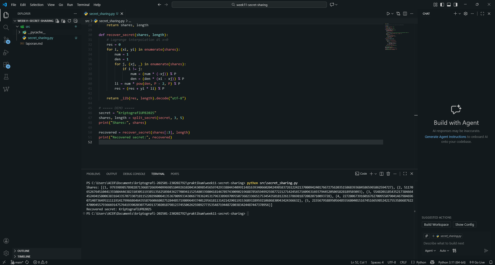

# Laporan Praktikum Kriptografi
Minggu ke-: X  
Topik: [Secret Sharing]  
Nama: [Zaki Fauzan Sultom]  
NIM: [230202792]  
Kelas: [5IKRA]  

---

## 1. Tujuan
1. Menjelaskan konsep **Shamir Secret Sharing** (SSS).  
2. Melakukan simulasi pembagian rahasia ke beberapa pihak menggunakan skema SSS.  
3. Menganalisis keamanan skema distribusi rahasia.

---

## 2. Dasar Teori
Secret Sharing adalah teknik kriptografi yang memecah sebuah rahasia (seperti private key atau kata sandi) menjadi beberapa bagian kecil yang disebut shares atau shadows, yang kemudian didistribusikan kepada sekelompok partisipan. Prinsip utamanya adalah mencegah "titik kegagalan tunggal" (single point of failure). Dalam skema ini, rahasia asli tidak pernah disimpan secara utuh di satu tempat; sebaliknya, rahasia tersebut hanya dapat dipulihkan atau direkonstruksi apabila sejumlah minimum partisipan (disebut threshold atau ambang batas, $k$) menggabungkan bagian mereka. Jika jumlah shares yang dikumpulkan kurang dari ambang batas tersebut, maka tidak ada informasi apa pun mengenai rahasia asli yang bisa didapatkan, sehingga sistem ini sangat aman terhadap pencurian atau kehilangan data oleh satu individu.

Secara matematis, implementasi yang paling mendasar dan populer adalah Shamir's Secret Sharing, yang didasarkan pada konsep interpolasi polinomial Lagrange. Dalam skema ambang batas $(k, n)$, sebuah polinomial acak berderajat $k-1$ dibuat, di mana rahasia utamanya ditempatkan sebagai koefisien konstanta ($f(0)$). Setiap partisipan diberikan satu titik koordinat $(x, y)$ dari kurva tersebut. Karena dibutuhkan $k$ titik untuk mendefinisikan sebuah polinomial berderajat $k-1$ secara unik, maka $k$ partisipan mana pun dapat bekerja sama untuk menemukan kembali persamaan tersebut dan mengungkapkan rahasianya. Metode ini sering digunakan untuk mengamankan aset bernilai tinggi, seperti kunci root sertifikat keamanan, akses brankas digital, atau cold wallet mata uang kripto.

---

## 3. Alat dan Bahan
(- Python 3.x  
- Visual Studio Code / editor lain  
- Git dan akun GitHub  
- Library standar )

---

## 4. Langkah Percobaan
(Tuliskan langkah yang dilakukan sesuai instruksi.  
1. Buat folder berikut:  
   ```
   praktikum/week11-secret-sharing/
   ├─ src/
   ├─ screenshots/
   └─ laporan.md
   ```
2. Gunakan Python 3.11 atau lebih baru.  
3. Install library tambahan bila perlu
   atau gunakan implementasi mandiri dengan operasi aritmetika modular.
4. Salin atau modifikasi kode
5. Jalankan kode

---

## 5. Source Code

```python
import random

# Prime jauh lebih besar dari secret (aman untuk string pendek-menengah)
P = 2**521 - 1

def _b2i(b):
    return int.from_bytes(b, "big")

def _i2b(i, length):
    return i.to_bytes(length, "big")

def split_secret(secret, k, n):
    secret_bytes = secret.encode("utf-8")
    s = _b2i(secret_bytes)
    length = len(secret_bytes)

    if s >= P:
        raise ValueError("Secret terlalu besar untuk prime field yang dipakai. Perbesar P.")

    coeffs = [s] + [random.randrange(0, P) for _ in range(k - 1)]
    shares = []
    for x in range(1, n + 1):
        y = 0
        for i, a in enumerate(coeffs):
            y = (y + a * pow(x, i, P)) % P
        shares.append((x, y))

    return shares, length

def recover_secret(shares, length):
    # Lagrange interpolation di x=0
    res = 0
    for i, (xi, yi) in enumerate(shares):
        num = 1
        den = 1
        for j, (xj, _) in enumerate(shares):
            if i != j:
                num = (num * (-xj)) % P
                den = (den * (xi - xj)) % P
        li = num * pow(den, P - 2, P) % P
        res = (res + yi * li) % P

    return _i2b(res, length).decode("utf-8")

# ===== DEMO =====
secret = "KriptografiUPB2025"
shares, length = split_secret(secret, 3, 5)
print("Shares:", shares)

recovered = recover_secret(shares[:3], length)
print("Recovered secret:", recovered)
```
)

---

## 6. Hasil dan Pembahasan
### 6.1 Hasil Eksekusi Program

Program **Shamir Secret Sharing** berhasil dijalankan menggunakan **Python 3.11** tanpa menggunakan library eksternal. Pada pengujian ini, secret berupa string **“KriptografiUPB2025”** dibagi menjadi **5 buah share** dengan nilai ambang batas (**threshold**) sebesar **3**.

Hasil eksekusi menunjukkan bahwa sistem menghasilkan pasangan share dalam bentuk pasangan bilangan bulat **(x, y)**, di mana **x** merepresentasikan indeks share dan **y** merupakan hasil evaluasi polinomial pada titik tersebut. Contoh keluaran program ditunjukkan pada Gambar



Selanjutnya, dilakukan proses rekonstruksi secret menggunakan **3 share pertama**. Hasil rekonstruksi menunjukkan bahwa secret yang diperoleh kembali adalah **identik dengan secret asli**, yaitu *“KriptografiUPB2025”*. Hal ini membuktikan bahwa implementasi algoritma Shamir Secret Sharing telah berjalan dengan benar.

### 6.2 Pembahasan Hasil

Hasil pengujian menunjukkan bahwa mekanisme pembagian dan rekonstruksi secret telah sesuai dengan teori **Shamir Secret Sharing**. Penggunaan polinomial berderajat \(k-1\) menjamin bahwa secret hanya dapat direkonstruksi apabila jumlah share yang digunakan memenuhi atau melebihi nilai ambang batas yang ditentukan.

Pada tahap implementasi, sempat ditemukan error berupa kegagalan proses decoding UTF-8 pada saat rekonstruksi secret. Error tersebut disebabkan oleh pemilihan bilangan prima \(P\) yang terlalu kecil sehingga tidak mampu menampung representasi integer dari secret, serta tidak disimpannya informasi panjang byte secret. Permasalahan ini diselesaikan dengan menggunakan bilangan prima yang jauh lebih besar, yaitu \(2^{521} - 1\), serta menyimpan panjang byte secret sebagai metadata tambahan.

Setelah perbaikan dilakukan, proses rekonstruksi secret berjalan dengan stabil dan menghasilkan output yang valid. Implementasi ini menunjukkan bahwa algoritma Shamir Secret Sharing dapat diimplementasikan secara mandiri tanpa ketergantungan library eksternal, sekaligus memberikan transparansi algoritmik yang lebih baik dan kompatibilitas penuh dengan versi Python modern.


---

## 7. Jawaban Pertanyaan

1. **Apa keuntungan utama Shamir Secret Sharing dibanding membagikan salinan kunci secara langsung?**  
   Keuntungan utama Shamir Secret Sharing (SSS) adalah secret tidak pernah dibagikan atau disimpan secara utuh pada satu pihak. Setiap share yang dihasilkan tidak memberikan informasi apa pun mengenai secret jika berdiri sendiri. Dengan demikian, kebocoran satu atau beberapa share (selama jumlahnya kurang dari threshold) tidak menyebabkan secret terungkap. Hal ini jauh lebih aman dibandingkan pembagian salinan kunci secara langsung, di mana satu kebocoran saja sudah cukup untuk mengompromikan seluruh sistem.

2. **Apa peran threshold (k) dalam keamanan secret sharing?**  
   Threshold (k) menentukan jumlah minimum share yang diperlukan untuk merekonstruksi secret. Nilai ini berfungsi sebagai mekanisme pengendali keamanan, karena secret secara matematis tidak dapat dipulihkan apabila jumlah share yang tersedia kurang dari k. Dengan adanya threshold, sistem dapat menyeimbangkan antara aspek keamanan dan ketersediaan, yaitu mencegah akses tidak sah sekaligus memungkinkan pemulihan secret ketika sebagian share hilang.

3. **Berikan satu contoh skenario nyata di mana Shamir Secret Sharing sangat bermanfaat.**  
   Salah satu contoh penerapan Shamir Secret Sharing adalah pada manajemen kunci enkripsi di lingkungan organisasi. Sebuah kunci enkripsi utama dapat dibagi menjadi beberapa share dan didistribusikan kepada beberapa pejabat dengan threshold tertentu, misalnya 3 dari 5. Kunci hanya dapat direkonstruksi apabila minimal tiga pihak memberikan persetujuan, sehingga mencegah penyalahgunaan kunci oleh satu individu dan meningkatkan keamanan sistem secara keseluruhan.
 
---

## 8. Kesimpulan
Berdasarkan percobaan yang dilakukan, algoritma Shamir Secret Sharing terbukti mampu membagi secret menjadi beberapa share dan merekonstruksinya kembali secara tepat ketika jumlah share yang digunakan memenuhi nilai threshold. Implementasi tanpa library eksternal menunjukkan bahwa konsep dasar Shamir Secret Sharing dapat diterapkan secara mandiri dan kompatibel dengan Python modern. Hasil pengujian juga menegaskan bahwa secret tidak dapat diperoleh kembali apabila jumlah share yang digunakan kurang dari threshold yang ditentukan.

---

## 9. Daftar Pustaka
(Cantumkan referensi yang digunakan.  
Contoh:  
- Katz, J., & Lindell, Y. *Introduction to Modern Cryptography*.  
- Stallings, W. *Cryptography and Network Security*.  )

---

## 10. Commit Log

```
commit 1bc118335d8a550deaf1aaf45680b88d839967df
Author: Zaki Fauzan Sulton <a47922653@gmail.com>
Date:   Sat Jan 24 02:02:25 2026 +0700

    week11-secret-sharing
```
