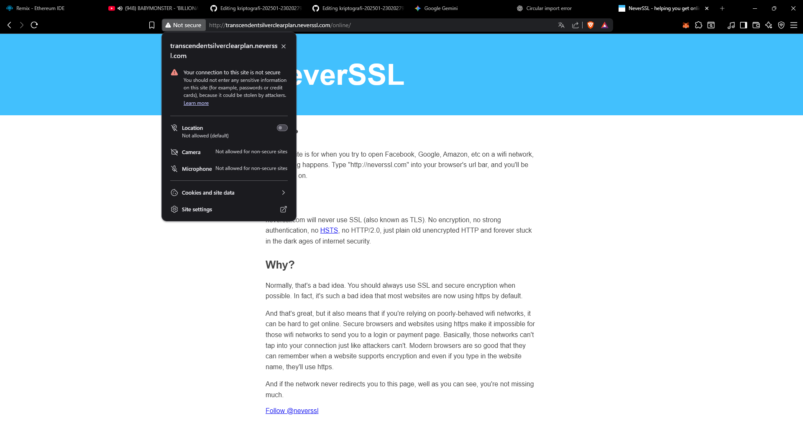
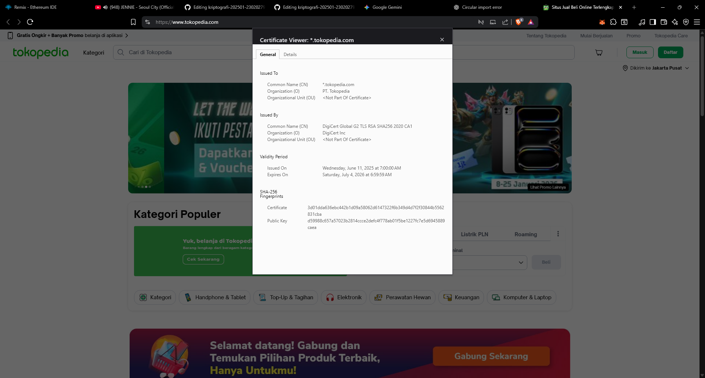
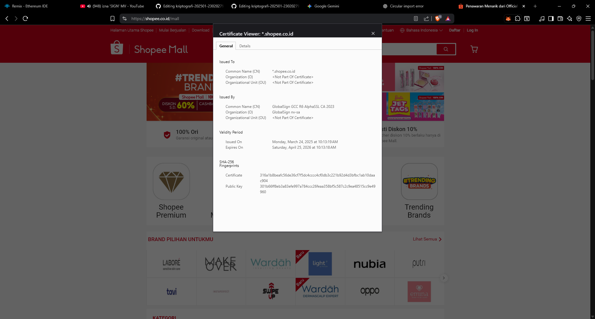

# Laporan Praktikum Kriptografi
Minggu ke-: X  
Topik: [aplikasi tls]  
Nama: [Zaki Fauzan Sulton]  
NIM: [230202792]  
Kelas: [5IKRA]  

---

## 1. Tujuan
1. Menganalisis penggunaan kriptografi pada **email** dan **SSL/TLS**.  
2. Menjelaskan enkripsi dalam transaksi **e-commerce**.  
3. Mengevaluasi isu **etika & privasi** dalam penggunaan kriptografi di kehidupan sehari-hari.  
---

## 2. Dasar Teori
Transport Layer Security (TLS) adalah protokol kriptografi standar industri yang dirancang untuk memberikan keamanan komunikasi melalui jaringan komputer, bertindak sebagai penerus dari protokol Secure Sockets Layer (SSL). Secara teoritis, aplikasi TLS beroperasi tepat di atas lapisan transport (seperti TCP) dan di bawah lapisan aplikasi dalam model OSI, yang bertujuan untuk menjamin tiga pilar utama keamanan informasi: kerahasiaan (confidentiality) melalui enkripsi data, integritas (integrity) melalui kode autentikasi pesan untuk mencegah perubahan data yang tidak sah, dan autentikasi (authentication) server (dan terkadang klien) menggunakan sertifikat digital X.509. Mekanisme ini memastikan bahwa data yang dikirimkan antara dua entitas (misalnya, browser dan server) tidak dapat disadap atau dimanipulasi oleh pihak ketiga.

Dalam penerapannya di dunia nyata, TLS menjadi fondasi bagi HTTPS (Hypertext Transfer Protocol Secure), yang wajib digunakan oleh situs web modern, terutama layanan perbankan dan e-commerce, untuk melindungi data sensitif pengguna. Selain web, TLS juga diaplikasikan secara luas untuk mengamankan protokol email (SMTPS, IMAPS), transfer file (FTPS), serta layanan Virtual Private Network (VPN). Proses pembentukan koneksi aman ini dimulai dengan fase TLS Handshake, di mana klien dan server saling menyepakati algoritma enkripsi (cipher suite) dan bertukar kunci sesi simetris, sehingga memungkinkan transmisi data yang aman dan efisien bahkan di jaringan publik yang tidak terpercaya seperti internet.

---

## 3. Alat dan Bahan
- Browser
- Git dan akun GitHub  

---

## 4. Langkah Percobaan
1. Buat folder berikut:  
   ```
   praktikum/week12-aplikasi-tls/
   ├─ screenshots/
   └─ laporan.md
   ```
2. Siapkan koneksi internet untuk mengamati penggunaan SSL/TLS (misalnya HTTPS pada browser).  

---

## 5. Hasil dan Pembahasan



### 5.1 Hasil Observasi Website Berbasis HTTP

Pengujian dilakukan pada website berbasis HTTP, yaitu `http://neverssl.com`. Berdasarkan hasil observasi, browser menandai koneksi sebagai **“Not Secure”** dan tidak menampilkan informasi sertifikat digital. Hal ini terjadi karena protokol HTTP tidak menggunakan mekanisme SSL/TLS sehingga tidak menyediakan enkripsi maupun autentikasi server.

Pada website HTTP, data dikirimkan dalam bentuk plaintext dan rentan terhadap penyadapan serta manipulasi data. Browser juga memberikan peringatan kepada pengguna agar tidak memasukkan informasi sensitif. Hasil ini menunjukkan bahwa komunikasi berbasis HTTP memiliki tingkat keamanan yang rendah.

### 5.2 Hasil Observasi Website Berbasis HTTPS (TLS)

Pengujian selanjutnya dilakukan pada website e-commerce **Tokopedia** yang menggunakan protokol **HTTPS**. Berdasarkan hasil observasi sertifikat digital, website Tokopedia menggunakan sertifikat TLS yang diterbitkan oleh **DigiCert Global G2 TLS RSA SHA256 2020 CA**. Sertifikat tersebut memiliki masa berlaku yang jelas dan menggunakan algoritma kriptografi modern seperti RSA dan SHA-256.

Keberadaan sertifikat digital memungkinkan browser untuk memverifikasi identitas server serta memastikan bahwa komunikasi antara pengguna dan server dienkripsi secara aman menggunakan TLS. Status koneksi ditandai dengan ikon gembok (secure), yang menandakan bahwa data pengguna terlindungi selama proses komunikasi.

### 5.3 Studi Kasus Penerapan TLS pada E-commerce

Pada sistem e-commerce, TLS digunakan untuk melindungi data sensitif pengguna, terutama saat proses login dan transaksi pembayaran. Ketika pengguna memasukkan username, password, atau informasi pembayaran, data tersebut dienkripsi oleh TLS sebelum dikirimkan ke server. Dengan demikian, pihak ketiga tidak dapat membaca atau memodifikasi data selama proses transmisi.

Apabila TLS tidak digunakan, sistem e-commerce sangat rentan terhadap berbagai ancaman keamanan, seperti serangan **Man-in-the-Middle (MitM)**. Dalam serangan ini, penyerang dapat menyadap atau memanipulasi data yang dikirimkan antara pengguna dan server, termasuk mencuri kredensial login atau informasi pembayaran. Oleh karena itu, penerapan TLS merupakan komponen krusial dalam menjaga keamanan transaksi online.


### 5.4 Analisis Etika dan Privasi dalam Penggunaan Kriptografi

Penggunaan email terenkripsi, seperti PGP dan S/MIME, bertujuan untuk melindungi privasi komunikasi pengguna dengan memastikan bahwa hanya pihak yang berwenang yang dapat membaca isi pesan. Namun, penerapan enkripsi juga menimbulkan isu privasi dan dilema etika, terutama dalam konteks organisasi dan pemerintahan.

Salah satu dilema etika yang muncul adalah apakah perusahaan diperbolehkan melakukan dekripsi email karyawan untuk keperluan audit atau pengawasan internal. Di satu sisi, perusahaan memiliki kepentingan untuk menjaga keamanan dan kepatuhan kebijakan, namun di sisi lain tindakan tersebut dapat melanggar privasi individu. Selain itu, kebijakan pemerintah terkait pengawasan komunikasi terenkripsi juga menimbulkan perdebatan antara kebutuhan keamanan nasional dan perlindungan hak privasi warga negara.


### 5.5 Kesesuaian Hasil dengan Ekspektasi

Hasil praktikum menunjukkan kesesuaian dengan teori yang dipelajari mengenai perbedaan HTTP dan HTTPS serta peran TLS dalam keamanan komunikasi digital. Website berbasis HTTP terbukti tidak memberikan perlindungan keamanan, sedangkan website HTTPS mampu melindungi data pengguna melalui mekanisme kriptografi. Selain itu, analisis etika dan privasi menunjukkan bahwa penerapan kriptografi tidak hanya berdampak teknis, tetapi juga memiliki implikasi sosial dan hukum.

---

## 6. Jawaban Pertanyaan
1. **Apa perbedaan utama antara HTTP dan HTTPS?**  
   Perbedaan utama antara HTTP dan HTTPS terletak pada aspek keamanan komunikasi. HTTP tidak menggunakan mekanisme enkripsi sehingga data dikirimkan dalam bentuk plaintext dan rentan terhadap penyadapan maupun manipulasi. Sebaliknya, HTTPS menggunakan protokol TLS untuk mengenkripsi data, menyediakan autentikasi server melalui sertifikat digital, serta menjaga kerahasiaan dan integritas informasi yang dikirimkan.

2. **Mengapa sertifikat digital menjadi penting dalam komunikasi TLS?**  
   Sertifikat digital berfungsi untuk memverifikasi identitas server yang berkomunikasi dengan klien sehingga mencegah pengguna terhubung ke server palsu. Sertifikat ini dikeluarkan oleh Certificate Authority (CA) terpercaya dan mengikat identitas server dengan kunci publiknya. Dengan demikian, sertifikat digital menjadi komponen penting dalam membangun kepercayaan dan keamanan pada komunikasi berbasis TLS.

3. **Bagaimana kriptografi mendukung privasi dalam komunikasi digital, tetapi sekaligus menimbulkan tantangan hukum dan etika?**  
   Kriptografi mendukung privasi dengan mengenkripsi data sehingga hanya pihak yang berwenang yang dapat mengakses isi komunikasi, seperti pada email terenkripsi dan koneksi TLS. Namun, penggunaan enkripsi juga menimbulkan tantangan hukum dan etika karena dapat membatasi kemampuan pihak berwenang atau organisasi dalam melakukan pengawasan dan penegakan hukum. Hal ini memunculkan dilema antara perlindungan privasi individu dan kebutuhan keamanan serta kepatuhan terhadap regulasi.

---

## 7. Kesimpulan
Berdasarkan hasil praktikum, penggunaan protokol HTTPS dengan TLS terbukti mampu melindungi komunikasi data melalui mekanisme enkripsi dan autentikasi server, berbeda dengan HTTP yang tidak menyediakan perlindungan keamanan. Penerapan TLS sangat penting pada layanan e-commerce untuk menjaga kerahasiaan dan integritas data pengguna. Selain aspek teknis, penggunaan kriptografi juga membawa implikasi etika dan hukum yang perlu dipertimbangkan dalam praktik komunikasi digital.

---

## 8. Daftar Pustaka
(Cantumkan referensi yang digunakan.  
Contoh:  
- Katz, J., & Lindell, Y. *Introduction to Modern Cryptography*.  
- Stallings, W. *Cryptography and Network Security*.  )

---

## 9. Commit Log

```
commit 65834e964c66e612a4400daf9654dbe2424ca316
Author: Zaki Fauzan Sulton <a47922653@gmail.com>
Date:   Sat Jan 24 02:27:31 2026 +0700

    week12-aplikasi-tls
```
