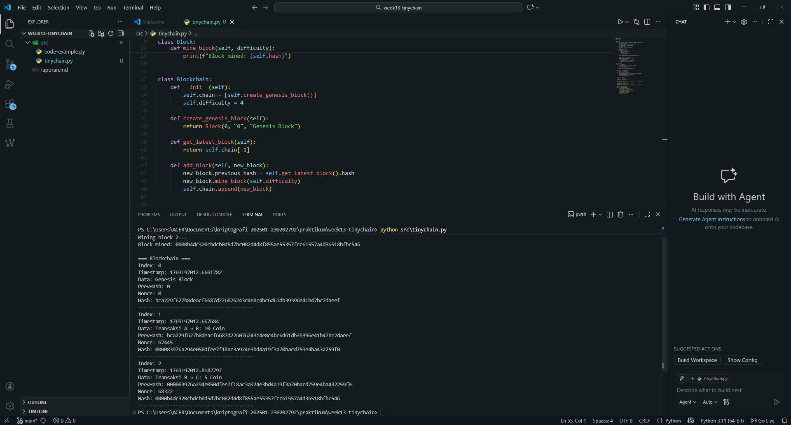

# Laporan Praktikum Kriptografi
Minggu ke-: 13  
Topik: [tinychain]  
Nama: [Zaki Fauzan Sulton]  
NIM: [230202792]  
Kelas: [5IKRA]  

---

## 1. Tujuan
1. Menjelaskan peran **hash function** dalam blockchain.  
2. Melakukan simulasi sederhana **Proof of Work (PoW)**.  
3. Menganalisis keamanan cryptocurrency berbasis kriptografi.  

---

## 2. Dasar Teori
TinyChain secara teoritis adalah sebuah mesin keadaan terdistribusi (distributed state machine) yang memadukan konsep basis data graf (graph database) dengan struktur data blockchain. Tidak seperti blockchain konvensional yang hanya menyimpan buku besar transaksi, TinyChain menganggap seluruh arsitektur cloud sebagai satu graf raksasa yang saling terhubung. Dalam model ini, kode aplikasi, data, dan logika bisnis disimpan dalam struktur rantai blok yang tidak dapat diubah (immutable), memungkinkan transaksi lintas-layanan (cross-service transactions) terjadi secara atomik tanpa memerlukan kode perantara (glue code) yang rumit.

Dari sisi keamanan kriptografi, TinyChain menggunakan mekanisme otentikasi rekursif berbasis tanda tangan digital (sering kali menggunakan recursive JSON Web Tokens atau rJWT) dan struktur Merkle Tree. Setiap kali sebuah layanan memanggil layanan lain dalam jaringan, permintaan tersebut membawa jejak kriptografis yang memvalidasi seluruh rantai pemanggilan (chain of custody). Hal ini memastikan bahwa setiap perubahan status (state change) dapat diverifikasi asal-usul dan otoritasnya secara matematis, menciptakan lingkungan "trust-less" di mana layanan-layanan mikro (microservices) dapat saling berinteraksi dengan aman tanpa perlu saling mempercayai infrastruktur internal masing-masing secara buta.

---

## 3. Alat dan Bahan
(- Python 3.x  
- Visual Studio Code / editor lain  
- Git dan akun GitHub  
- Library standar

---

## 4. Langkah Percobaan
(Tuliskan langkah yang dilakukan sesuai instruksi.  
Contoh format:
1. Buat folder berikut:  
   ```
   praktikum/week13-tinychain/
   ├─ src/
   ├─ screenshots/
   └─ laporan.md
   ```
2. Menyalin kode program dari panduan praktikum.
3. Menjalankan program dengan perintah `python tinychain.py`.

---

## 5. Source Code

```python
import hashlib
import time


class Block:
    def __init__(self, index, previous_hash, data, timestamp=None):
        self.index = index
        self.timestamp = timestamp or time.time()
        self.data = data
        self.previous_hash = previous_hash
        self.nonce = 0
        self.hash = self.calculate_hash()

    def calculate_hash(self):
        value = (
            str(self.index)
            + str(self.timestamp)
            + str(self.data)
            + str(self.previous_hash)
            + str(self.nonce)
        )
        return hashlib.sha256(value.encode()).hexdigest()

    def mine_block(self, difficulty):
        target = "0" * difficulty
        while self.hash[:difficulty] != target:
            self.nonce += 1
            self.hash = self.calculate_hash()
        print(f"Block mined: {self.hash}")


class Blockchain:
    def __init__(self):
        self.chain = [self.create_genesis_block()]
        self.difficulty = 4

    def create_genesis_block(self):
        return Block(0, "0", "Genesis Block")

    def get_latest_block(self):
        return self.chain[-1]

    def add_block(self, new_block):
        new_block.previous_hash = self.get_latest_block().hash
        new_block.mine_block(self.difficulty)
        self.chain.append(new_block)


if __name__ == "__main__":
    # Uji coba blockchain
    my_chain = Blockchain()

    print("Mining block 1...")
    my_chain.add_block(Block(1, "", "Transaksi A → B: 10 Coin"))

    print("Mining block 2...")
    my_chain.add_block(Block(2, "", "Transaksi B → C: 5 Coin"))

    # Tampilkan ringkas chain
    print("\n=== Blockchain ===")
    for b in my_chain.chain:
        print(f"Index: {b.index}")
        print(f"Timestamp: {b.timestamp}")
        print(f"Data: {b.data}")
        print(f"PrevHash: {b.previous_hash}")
        print(f"Nonce: {b.nonce}")
        print(f"Hash: {b.hash}")
        print("-" * 40)
```
)

---

## 6. Hasil dan Pembahasan

### 6.1 Hasil Eksekusi Program

Program `tinychain.py` berhasil dijalankan dan menghasilkan sebuah blockchain sederhana yang terdiri dari **Genesis Block (index 0)** serta **dua blok transaksi (index 1 dan 2)**. Saat eksekusi, sistem melakukan proses **mining** pada blok baru menggunakan mekanisme **Proof-of-Work (PoW)**, yang ditandai dengan munculnya output `Block mined: ...` pada terminal.

Pada hasil yang terlihat di terminal, hash blok hasil mining memiliki awalan **`0000`**. Hal ini sesuai dengan parameter **difficulty = 4**, yaitu syarat bahwa hash blok harus memiliki **empat digit nol di awal** sebelum dianggap valid. Setelah mining selesai, program menampilkan detail setiap blok (index, timestamp, data, prevHash, nonce, hash) sehingga struktur rantai dapat diverifikasi secara manual.


### 6.2 Pembahasan Mekanisme Proof-of-Work (Mining)

Mining dilakukan dengan menaikkan nilai **nonce** hingga menghasilkan hash yang memenuhi target kesulitan (`"0" * difficulty`). Semakin besar nilai difficulty, semakin sulit menemukan hash yang cocok dan semakin lama proses mining. Pada hasil pengujian ini, nonce yang dihasilkan berbeda untuk setiap blok, menunjukkan bahwa sistem benar-benar melakukan iterasi untuk memenuhi target hash.

Mekanisme ini merepresentasikan konsep PoW pada blockchain nyata: validasi blok membutuhkan komputasi (mencari nonce), sehingga menyulitkan pihak lain untuk memalsukan blok tanpa melakukan kerja komputasi serupa.

### 6.3 Pembahasan Struktur Rantai dan Integritas Data

Dari output yang ditampilkan, setiap blok memiliki atribut **previous_hash (PrevHash)** yang berisi hash dari blok sebelumnya. Misalnya:
- Blok index 1 memiliki `PrevHash` yang sama dengan hash Genesis Block.
- Blok index 2 memiliki `PrevHash` yang sama dengan hash blok index 1.

Keterkaitan ini membentuk rantai yang menjaga **integritas**: apabila isi data pada salah satu blok diubah (misalnya “Transaksi A → B: 10 Coin”), maka nilai hash blok tersebut juga berubah. Perubahan hash menyebabkan `PrevHash` pada blok berikutnya tidak lagi cocok, sehingga rantai menjadi tidak valid. Dengan demikian, struktur hash berantai berfungsi sebagai mekanisme deteksi perubahan data (tamper-evidence).


### 6.4 Kesesuaian Hasil dengan Ekspektasi

Hasil praktikum sesuai dengan konsep teori blockchain dasar. Program berhasil:
1. Membentuk blok dengan hash SHA-256 dari kombinasi data, timestamp, previous hash, dan nonce.
2. Menerapkan Proof-of-Work melalui pencarian nonce sampai hash memenuhi difficulty.
3. Menyusun blockchain di mana setiap blok terhubung melalui `previous_hash`.

Dengan demikian, implementasi `tinychain.py` telah menunjukkan prinsip utama blockchain: **hashing**, **proof-of-work**, dan **keterkaitan antar blok untuk menjaga integritas data**.

---

## 7. Jawaban Pertanyaan
1. **Mengapa fungsi hash sangat penting dalam blockchain?**  
   Fungsi hash sangat penting dalam blockchain karena digunakan untuk menjamin **integritas data** dan menghubungkan setiap blok dalam rantai. Setiap blok memiliki hash unik yang bergantung pada isi data, nonce, dan hash blok sebelumnya. Jika data pada satu blok diubah, maka nilai hash juga berubah, sehingga perubahan tersebut dapat dengan mudah terdeteksi dan merusak keterkaitan dengan blok berikutnya.

2. **Bagaimana Proof of Work mencegah double spending?**  
   Proof of Work (PoW) mencegah double spending dengan mewajibkan setiap transaksi dicatat dalam blok yang telah divalidasi melalui proses komputasi (mining). Karena pembuatan blok membutuhkan waktu dan sumber daya komputasi, penyerang tidak dapat dengan mudah membuat dua versi transaksi yang saling bertentangan. Setelah sebuah transaksi tercatat dalam blockchain dan diikuti oleh blok-blok berikutnya, transaksi tersebut dianggap final dan tidak dapat dibelanjakan kembali.

3. **Apa kelemahan dari Proof of Work dalam hal efisiensi energi?**  
   Kelemahan utama Proof of Work adalah konsumsi energi yang sangat tinggi. Proses mining membutuhkan komputasi intensif untuk mencari nonce yang memenuhi target hash, sehingga menghabiskan banyak listrik dan sumber daya perangkat keras. Hal ini membuat PoW kurang efisien secara energi dan menimbulkan dampak lingkungan yang signifikan, terutama pada blockchain berskala besar.

---

## 8. Kesimpulan
Berdasarkan hasil praktikum, implementasi *tinychain* berhasil menunjukkan konsep dasar blockchain, yaitu penggunaan fungsi hash, keterkaitan antar blok melalui *previous hash*, dan mekanisme *Proof of Work*. Proses mining membuktikan bahwa validasi blok memerlukan usaha komputasi sehingga meningkatkan keamanan dan integritas data. Dengan demikian, praktikum ini membantu memahami bagaimana blockchain menjaga konsistensi data serta mencegah manipulasi transaksi.

---

## 9. Daftar Pustaka
(Cantumkan referensi yang digunakan.  
Contoh:  
- Katz, J., & Lindell, Y. *Introduction to Modern Cryptography*.  
- Stallings, W. *Cryptography and Network Security*.  )

---

## 10. Commit Log

```
commit 1d4bbca877b8a97efa36f5e5a8acda74cbc9b51b
Author: Zaki Fauzan Sulton <a47922653@gmail.com>
Date:   Sat Jan 24 02:46:59 2026 +0700

    week13-tinychain
```
