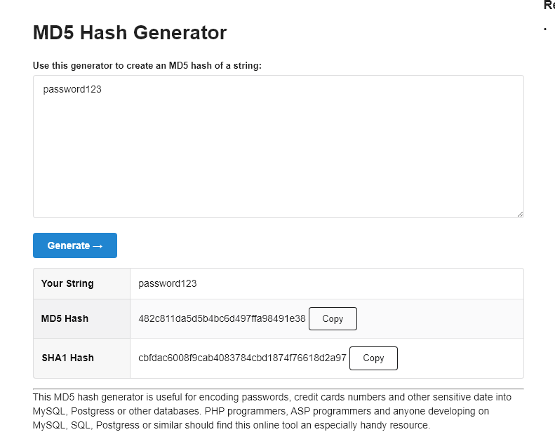

# Laporan Praktikum Kriptografi
Minggu ke-: 14  
Topik: [Analisis Serangan]  
Nama: [Zaki Fauzan Sulton]  
NIM: [230202792]  
Kelas: [5IKRA]  

---

## 1. Tujuan
1. Mengidentifikasi jenis serangan pada sistem informasi nyata.  
2. Mengevaluasi kelemahan algoritma kriptografi yang digunakan.  
3. Memberikan rekomendasi algoritma kriptografi yang sesuai untuk perbaikan keamanan.  

---

## 2. Dasar Teori
Analisis serangan (attack analysis) adalah proses forensik dan teoritis untuk mendekonstruksi sebuah insiden keamanan guna mengidentifikasi vektor serangan, jalur spesifik yang dieksploitasi penyerang untuk menembus sistem kriptografi. Dalam teori keamanan informasi, fase ini berfokus pada pemetaan "permukaan serangan" (attack surface) untuk menentukan apakah penyerang memanipulasi input (seperti pada SQL Injection atau Buffer Overflow), mengeksploitasi entropi rendah (seperti pada Brute Force atau Dictionary Attack), atau memanfaatkan celah pada protokol komunikasi (seperti pada serangan Man-in-the-Middle). Identifikasi ini krusial untuk membedakan antara serangan yang bersifat oportunistik (acak) dan serangan yang ditargetkan (targeted), serta menjadi landasan fakta untuk langkah evaluasi selanjutnya.

Tahap evaluasi kelemahan didasarkan pada taksonomi kegagalan kriptografi yang membagi kerentanan menjadi dua kategori fundamental: kelemahan algoritmik dan kegagalan implementasi/konfigurasi. Secara teoritis, kelemahan algoritmik terjadi ketika matematika yang mendasari sistem tersebut rusak (misalnya, terjadinya collision pada fungsi hash MD5 yang melanggar prinsip resistensi tabrakan). Sebaliknya, kegagalan implementasi terjadi ketika algoritma yang kuat diterapkan secara salah oleh manusia, seperti penggunaan mode of operation (ECB) yang tidak aman pada AES, pengelolaan kunci yang buruk, atau konfigurasi SSL/TLS yang usang (misalnya Heartbleed atau POODLE). Memisahkan kedua domain ini adalah inti dari analisis serangan untuk menentukan mitigasi yang tepat: apakah perlu mengganti standar algoritma secara total atau cukup memperbaiki konfigurasi sistem yang ada.

---

## 3. Alat dan Bahan
- Browser
- Git dan akun GitHub  

---

## 4. Langkah Percobaan
1. Buat folder berikut:  
   ```
   praktikum/week14-analisis-serangan/
   ├─ screenshots/
   └─ laporan.md
   ```
2. Diskusikan studi kasus sistem nyata (contoh: serangan brute force pada password lemah, serangan MITM pada komunikasi TLS, serangan replay pada protokol autentikasi).  

---

## 5. Hasil dan Pembahasan



### 5.1 Identifikasi Serangan (Kasus Nyata 123RF)

Berdasarkan hasil observasi pada sumber UpGuard, salah satu kasus nyata serangan kriptografi terjadi pada platform **123RF** pada November 2020. Dalam insiden tersebut, sekitar **8,3 juta data pengguna** berhasil diakses dan diperjualbelikan di forum peretas. Data yang bocor mencakup informasi pribadi seperti email, alamat IP, serta **password yang disimpan dalam bentuk hash MD5**.

Jenis serangan yang relevan pada kasus ini adalah **brute force dan dictionary attack terhadap hash MD5**. Vektor serangan terjadi setelah database bocor, di mana penyerang memperoleh hash password pengguna. Karena MD5 merupakan algoritma hash yang cepat dan sudah tidak aman, penyerang dapat dengan mudah mencoba berbagai kombinasi password menggunakan alat cracking hingga menemukan nilai plaintext yang sesuai.

Penyebab utama kelemahan pada kasus ini adalah penggunaan algoritma hash MD5 untuk penyimpanan password, yang sudah diketahui rentan terhadap serangan brute force dan tidak lagi direkomendasikan untuk sistem modern.


### 5.2 Evaluasi Kelemahan Sistem

Hasil analisis menunjukkan bahwa kelemahan pada kasus 123RF tidak hanya berasal dari satu aspek, melainkan kombinasi beberapa faktor. Dari sisi **algoritma kriptografi**, MD5 memiliki kelemahan mendasar karena kecepatan komputasinya yang tinggi dan telah terbukti rentan terhadap collision serta cracking.

Dari sisi **implementasi**, password disimpan dalam bentuk hash MD5 tanpa mekanisme perlindungan tambahan seperti salt atau key stretching. Hal ini mempermudah penyerang untuk menggunakan tabel rainbow atau kamus password umum. Selain itu, dari sisi **konfigurasi sistem**, tidak terdapat informasi bahwa sistem menerapkan pembatasan percobaan login atau kebijakan password yang kuat, sehingga risiko kompromi akun semakin meningkat setelah kebocoran data terjadi.


### 5.3 Rekomendasi Solusi Keamanan

Berdasarkan kelemahan yang diidentifikasi, penggunaan algoritma MD5 untuk penyimpanan password sebaiknya dihentikan dan diganti dengan algoritma yang lebih aman seperti **bcrypt, scrypt, atau Argon2**. Algoritma tersebut dirancang khusus untuk hashing password dan memiliki sifat komputasi yang lebih lambat, sehingga secara signifikan menghambat serangan brute force dan dictionary.

Selain itu, sistem perlu menerapkan **salt unik** untuk setiap password guna mencegah penggunaan tabel precomputed seperti rainbow table. Dari sisi konfigurasi, penerapan **rate limiting**, kebijakan password yang kuat, serta audit keamanan berkala juga sangat disarankan. Implementasi solusi tersebut akan meningkatkan ketahanan sistem terhadap serangan kriptografi dan mengurangi risiko kebocoran data pengguna di masa depan.

#### Sebagai ilustrasi kelemahan algoritma MD5, dilakukan simulasi pembuatan hash MD5 dari password sederhana menggunakan generator hash daring. Hasil simulasi menunjukkan bahwa password sederhana dapat diubah menjadi hash MD5 dengan cepat, yang berpotensi direkonstruksi kembali melalui serangan brute force atau dictionary attack.

---

## 7. Jawaban Pertanyaan
1. **Mengapa banyak sistem lama masih rentan terhadap brute force atau dictionary attack?**  
   Banyak sistem lama masih rentan karena menggunakan algoritma kriptografi yang sudah usang, seperti MD5 atau SHA-1, yang memiliki kecepatan komputasi tinggi dan tidak dirancang untuk melindungi password. Selain itu, sistem lama sering kali tidak menerapkan mekanisme tambahan seperti salt, key stretching, rate limiting, dan kebijakan password yang kuat, sehingga memudahkan penyerang melakukan percobaan password secara berulang.

2. **Apa bedanya kelemahan algoritma dengan kelemahan implementasi?**  
   Kelemahan algoritma berkaitan dengan desain kriptografi itu sendiri, misalnya algoritma yang sudah terbukti tidak aman atau memiliki collision yang mudah ditemukan. Sementara itu, kelemahan implementasi terjadi ketika algoritma yang sebenarnya aman digunakan dengan cara yang salah, seperti tidak menggunakan salt, konfigurasi parameter yang lemah, atau kesalahan dalam penerapan pada sistem.

3. **Bagaimana organisasi dapat memastikan sistem kriptografi mereka tetap aman di masa depan?**  
   Organisasi dapat memastikan keamanan sistem kriptografi dengan melakukan pembaruan algoritma secara berkala sesuai standar terbaru, menerapkan praktik keamanan yang baik seperti penggunaan algoritma khusus password (bcrypt, scrypt, atau Argon2), serta melakukan audit dan pengujian keamanan secara rutin. Selain itu, mengikuti rekomendasi dari standar internasional dan komunitas keamanan juga penting untuk menghadapi perkembangan ancaman di masa depan.

---

## 8. Kesimpulan
Berdasarkan analisis kasus nyata kebocoran data 123RF, penggunaan algoritma kriptografi yang lemah seperti MD5 terbukti meningkatkan risiko serangan brute force dan dictionary attack. Kelemahan tersebut tidak hanya berasal dari algoritma yang sudah usang, tetapi juga dari implementasi dan konfigurasi sistem yang kurang memadai. Oleh karena itu, pemilihan algoritma yang tepat serta penerapan praktik keamanan yang baik menjadi faktor penting dalam menjaga keamanan sistem kriptografi.

---

## 9. Daftar Pustaka
(Cantumkan referensi yang digunakan.  
Contoh:  
- Katz, J., & Lindell, Y. *Introduction to Modern Cryptography*.  
- Stallings, W. *Cryptography and Network Security*.  )

---

## 10. Commit Log
(Tuliskan bukti commit Git yang relevan.  
Contoh:
```
commit 4a1de72f221e3b9273553f34c8e99838ff3f9289
Author: Zaki Fauzan Sulton <a47922653@gmail.com>
Date:   Sat Jan 24 03:15:17 2026 +0700

    week14-analisis-serangan
```
