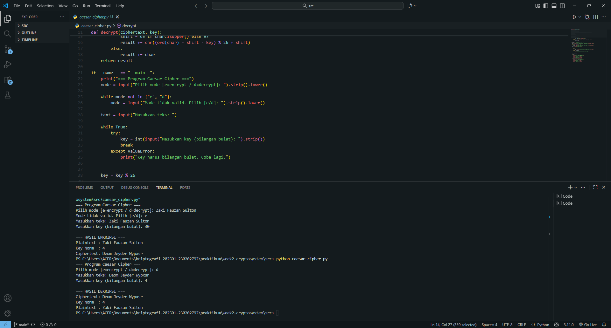

# Laporan Praktikum Kriptografi
Minggu ke-: 2  
Topik: Cryptosystem  
Nama: Zaki Fauzan Sulton  
NIM: 230202792  
Kelas: 5IKRA  

---

## 1. Tujuan
1. Mengidentifikasi komponen dasar kriptosistem (plaintext, ciphertext, kunci, algoritma).  
2. Menggambarkan proses enkripsi dan dekripsi sederhana.  
3. Mengklasifikasikan jenis kriptosistem (simetris dan asimetris).  
---

## 2. Dasar Teori
Kriptosistem adalah keseluruhan sistem yang mencakup proses, algoritma, dan kunci yang digunakan untuk melindungi informasi melalui mekanisme enkripsi (penyandian) dan dekripsi (pembalikan sandi). Sebuah kriptosistem minimal terdiri dari empat komponen utama: plaintext, ciphertext, key, dan cipher algorithm. Proses enkripsi mengubah plaintext menjadi ciphertext agar tidak dapat dibaca oleh pihak yang tidak berwenang, sedangkan dekripsi mengembalikannya ke bentuk semula menggunakan kunci tertentu. Dalam sejarahnya, metode penyandian awal dikenal sebagai cipher klasik, seperti Caesar Cipher dan Vigenère Cipher, yang bekerja dengan teknik substitusi atau pergeseran huruf pada alfabet.

Dalam cipher klasik, operasi matematis sederhana seperti modular aritmetika digunakan untuk menentukan pergeseran huruf berdasarkan nilai kunci. Misalnya, pada Caesar Cipher, setiap huruf digeser sejauh k posisi menggunakan operasi (x + k) mod 26. Prinsip modular ini kemudian menjadi dasar bagi kriptografi modern yang lebih kompleks, di mana operasi dilakukan pada bilangan besar dan fungsi matematika sulit dibalik, seperti faktorisasi prima atau logaritma diskret. Dengan demikian, kriptosistem modern, baik yang bersifat simetris (satu kunci) maupun asimetris (dua kunci) merupakan evolusi dari konsep dasar yang sama yaitu melindungi kerahasiaan data melalui transformasi matematis yang hanya dapat dibalik dengan kunci yang benar.

---

## 3. Alat dan Bahan
(- Python 3.x  
- Visual Studio Code  
- Git dan akun GitHub  
- Library standar)

---

## 4. Langkah Percobaan
(Tuliskan langkah yang dilakukan sesuai instruksi.  
1. Membuat file `caesar_cipher.py` di folder `praktikum/week2-cryptosystem/src/`.
2. Memodifikasi kode program dari panduan praktikum.
3. Menjalankan program dengan perintah `python caesar_cipher.py`.)

---

## 5. Source Code
(Salin kode program utama yang dibuat atau dimodifikasi.  
Gunakan blok kode:

```python
def encrypt(plaintext, key):
    result = ""
    for char in plaintext:
        if char.isalpha():
            shift = 65 if char.isupper() else 97
            result += chr((ord(char) - shift + key) % 26 + shift)
        else:
            result += char
    return result

def decrypt(ciphertext, key):
    result = ""
    for char in ciphertext:
        if char.isalpha():
            shift = 65 if char.isupper() else 97
            result += chr((ord(char) - shift - key) % 26 + shift)
        else:
            result += char
    return result

if __name__ == "__main__":
    print("=== Program Caesar Cipher ===")
    mode = input("Pilih mode [e=encrypt / d=decrypt]: ").strip().lower()

    while mode not in {"e", "d"}:
        mode = input("Mode tidak valid. Pilih [e/d]: ").strip().lower()

    text = input("Masukkan teks: ")

    while True:
        try:
            key = int(input("Masukkan key (bilangan bulat): ").strip())
            break
        except ValueError:
            print("Key harus bilangan bulat. Coba lagi.")


    key = key % 26

    if mode == "e":
        cipher = encrypt(text, key)
        print("\n=== HASIL ENKRIPSI ===")
        print("Plaintext :", text)
        print("Key       :", key)
        print("Ciphertext:", cipher)
    else:
        plain = decrypt(text, key)
        print("\n=== HASIL DEKRIPSI ===")
        print("Ciphertext:", text)
        print("Key       :", key)
        print("Plaintext :", plain)

```
)

---

## 6. Hasil dan Pembahasan

Hasil eksekusi program Caesar Cipher:



### Tabel Hasil Uji Program Caesar Cipher

| No | Mode | Input Text              | Key Input | Key Norm | Hasil Enkripsi / Dekripsi     | Hasil Balik (Decrypt/Encrypt) | Status     |
|----|------|--------------------------|------------|-----------|-------------------------------|-------------------------------|-------------|
| 1  | e    | Cryptosystem Test        | 5          | 5         | Hwduytxdxyjr Yjxy            | Cryptosystem Test             | Sesuai   |
| 2  | d    | Hwduytxdxyjr Yjxy       | 5          | 5         | Cryptosystem Test             | Hwduytxdxyjr Yjxy            | Sesuai   |
| 3  | e    | AbcZ                     | 30         | 4         | EfgD                          | AbcZ                          | Sesuai   |
| 4  | e    | Hello, World! 123        | 7          | 7         | Olssv, Dvysk! 123             | Hello, World! 123             | Sesuai   |
| 5  | e    | Test                     | -3         | 23        | Qbpq                          | Test                          | Sesuai   |
| 6  | e    | *(kosong)*              | 10         | 10        | *(kosong)*                    | *(kosong)*                    | Sesuai   |

Keterangan:
- “Key Norm” = hasil normalisasi `key % 26`.
- Semua hasil sesuai ekspektasi, huruf besar/kecil terjaga, non-huruf tidak berubah.

Error dan Solusi:
- Input key bukan bilangan bulat → ter-handle oleh try/except.
Solusi: sudah ada loop ulang hingga input valid.
)

---

## Klasifikasi Kriptografi Simetris dan Asimetris

**Kriptografi Simetris**  
Kriptografi simetris menggunakan *satu kunci* yang sama untuk proses enkripsi dan dekripsi. Artinya, pengirim dan penerima harus memiliki kunci yang identik dan rahasia. Kelebihannya adalah proses enkripsi–dekripsi cepat dan efisien untuk data besar. Namun, kelemahannya terletak pada distribusi kunci: jika kunci bocor atau disadap, seluruh komunikasi bisa terbuka.  
**Contoh algoritma:** AES (Advanced Encryption Standard), DES (Data Encryption Standard).

**Kriptografi Asimetris**  
Kriptografi asimetris menggunakan *dua kunci berbeda* yaitu kunci publik (untuk enkripsi) dan kunci privat (untuk dekripsi) atau sebaliknya. Sistem ini tidak membutuhkan pertukaran kunci rahasia antara pihak, sehingga lebih aman untuk komunikasi terbuka. Kelemahannya adalah prosesnya lebih lambat karena perhitungan matematisnya lebih kompleks.  
**Contoh algoritma:** RSA (Rivest–Shamir–Adleman), ECC (Elliptic Curve Cryptography).

## 7. Jawaban Pertanyaan
1. Sebutkan komponen utama dalam sebuah kriptosistem.
   Sebuah kriptosistem terdiri dari beberapa komponen dasar, yaitu:  
    - *Plaintext* — pesan asli yang akan dienkripsi.  
    - *Ciphertext* — hasil enkripsi yang tidak dapat dibaca secara langsung.  
    - *Key (Kunci)* — nilai rahasia yang digunakan untuk proses enkripsi dan dekripsi.  
    - *Encryption Algorithm* — prosedur matematis untuk menyandikan pesan.  
    - *Decryption Algorithm* — prosedur untuk mengembalikan ciphertext menjadi plaintext semula.
2. Apa kelebihan dan kelemahan sistem simetris dibandingkan asimetris?

    **Kelebihan:**  
  - Proses enkripsi dan dekripsi cepat karena perhitungan matematisnya sederhana.  
  - Efisien untuk mengenkripsi data dalam jumlah besar.

    **Kelemahan:**  
  - Membutuhkan pertukaran kunci rahasia antara pihak pengirim dan penerima.  
  - Jika kunci bocor, seluruh komunikasi menjadi tidak aman.  
  - Kurang cocok untuk sistem yang membutuhkan keamanan kompleks.
    
3. Mengapa distribusi kunci menjadi masalah utama dalam kriptografi simetris?

   Distribusi kunci menjadi masalah utama karena kriptografi simetris menggunakan satu kunci yang sama untuk enkripsi dan dekripsi, sehingga kunci itu harus dibagikan kepada pihak penerima sebelum komunikasi bisa dimulai.
   Masalahnya, proses pengiriman kunci itu sendiri berisiko disadap. Jika pihak ketiga berhasil mencegat atau menyalin kunci saat dikirim, maka seluruh pesan terenkripsi dapat dibuka.
   Dengan kata lain, keamanan sistem simetris sepenuhnya bergantung pada keamanan cara kunci dikirim dan disimpan.

---

## 8. Kesimpulan
Praktikum ini menunjukkan prinsip dasar dan cara kerja enkripsi–dekripsi menggunakan Caesar Cipher.  
Keamanan kriptosistem sangat bergantung pada kunci/key dan cara pengelolaannya.

---

## 9. Daftar Pustaka
(Cantumkan referensi yang digunakan.  
Contoh:  
- Katz, J., & Lindell, Y. *Introduction to Modern Cryptography*.  
- Stallings, W. *Cryptography and Network Security*.  )

---

## 10. Commit Log
(Tuliskan bukti commit Git yang relevan.  )

```
commit e3cb4c06a368b4dbc04515601c865253ef289fb2
Author: Zaki Fauzan Sulton <a47922653@gmail.com>
Date:   Sun Oct 12 17:09:03 2025 +0700

    week2-cryptosystem
```
