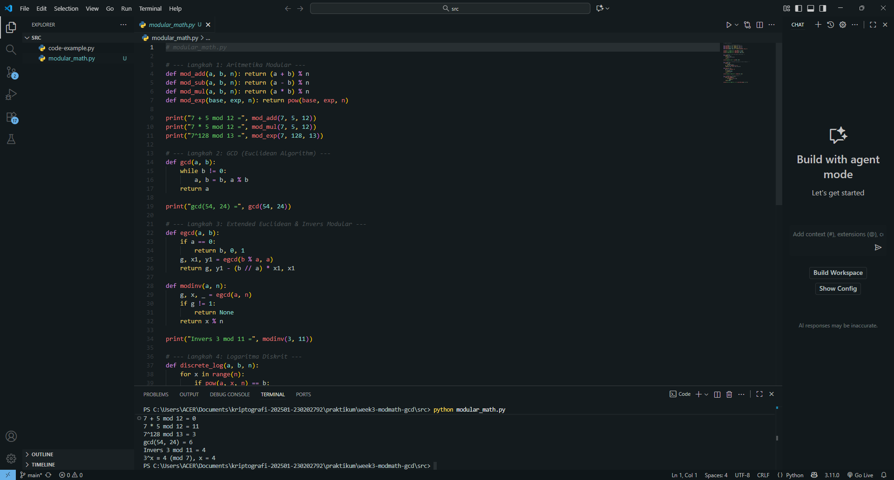

# Laporan Praktikum Kriptografi
Minggu ke-: 3  
Topik: Modular Math  
Nama: Zaki Fauzan Sulton  
NIM: 230202793  
Kelas: 5IKRA  

---

## 1. Tujuan
1. Menyelesaikan operasi aritmetika modular.  
2. Menentukan bilangan prima dan menghitung GCD (Greatest Common Divisor).  
3. Menerapkan logaritma diskrit sederhana dalam simulasi kriptografi.

---

## 2. Dasar Teori
Aritmetika modular adalah sistem perhitungan yang menggunakan sisa hasil bagi terhadap suatu bilangan tetap yang disebut **modulus**. Dalam sistem ini, dua bilangan dianggap kongruen jika memiliki sisa yang sama saat dibagi dengan modulus tersebut, ditulis sebagai:

$$
a \equiv b \pmod{n}
$$

Operasi seperti penjumlahan, pengurangan, dan perkalian dilakukan dengan cara mengambil hasil modulo *n*. Prinsip ini menjaga nilai tetap berada dalam rentang 0 hingga *n−1* dan menjadi dasar bagi banyak algoritma komputasi modern, terutama dalam bidang kriptografi.

Konsep penting dalam aritmetika modular adalah **invers modular**, yaitu bilangan *x* yang memenuhi:

$$
a \. x \equiv 1 \pmod{n}
$$

Invers ini hanya ada jika *a* dan *n* relatif prima, yaitu:

$$
\gcd(a, n) = 1
$$

Untuk menghitungnya digunakan **Algoritma Extended Euclidean**, yang tidak hanya mencari *Greatest Common Divisor (GCD)* antara dua bilangan, tetapi juga koefisien yang memungkinkan pencarian invers modular. Invers modular sangat penting dalam algoritma kriptografi seperti **RSA**, karena digunakan dalam proses pembentukan kunci publik dan privat.

Selain itu, **logaritma diskrit** merupakan bagian lain dari aritmetika modular yang berfungsi mencari eksponen *x* pada persamaan:

$$
a^x \equiv b \pmod{n}
$$

Masalah ini sangat sulit diselesaikan untuk modulus besar, dan kesulitannya menjadi dasar keamanan berbagai sistem kriptografi modern seperti **Diffie–Hellman Key Exchange** dan **ElGamal**. Dengan demikian, aritmetika modular bukan hanya konsep matematika dasar, tetapi juga fondasi utama dari keamanan data dalam dunia digital.

---

## 3. Alat dan Bahan
(- Python 3.x  
- Visual Studio Code / editor lain  
- Git dan akun GitHub  
- Library tambahan (misalnya pycryptodome, jika diperlukan)  )

---

## 4. Langkah Percobaan
(Tuliskan langkah yang dilakukan sesuai instruksi.  
Contoh format:
1. Membuat file `caesar_cipher.py` di folder `praktikum/week2-cryptosystem/src/`.
2. Menyalin kode program dari panduan praktikum.
3. Menjalankan program dengan perintah `python caesar_cipher.py`.)

---

## 5. Source Code
(Salin kode program utama yang dibuat atau dimodifikasi.  
Gunakan blok kode:

```python
# contoh potongan kode
def encrypt(text, key):
    return ...
```
)

---

## 6. Hasil dan Pembahasan
(- Lampirkan screenshot hasil eksekusi program (taruh di folder `screenshots/`).  
- Berikan tabel atau ringkasan hasil uji jika diperlukan.  
- Jelaskan apakah hasil sesuai ekspektasi.  
- Bahas error (jika ada) dan solusinya. 

Hasil eksekusi program Caesar Cipher:




)

---

## 7. Jawaban Pertanyaan
(Jawab pertanyaan diskusi yang diberikan pada modul.  
- Pertanyaan 1: …  
- Pertanyaan 2: …  
)
---

## 8. Kesimpulan
(Tuliskan kesimpulan singkat (2–3 kalimat) berdasarkan percobaan.  )

---

## 9. Daftar Pustaka
(Cantumkan referensi yang digunakan.  
Contoh:  
- Katz, J., & Lindell, Y. *Introduction to Modern Cryptography*.  
- Stallings, W. *Cryptography and Network Security*.  )

---

## 10. Commit Log
(Tuliskan bukti commit Git yang relevan.  
Contoh:
```
commit abc12345
Author: Nama Mahasiswa <email>
Date:   2025-09-20

    week2-cryptosystem: implementasi Caesar Cipher dan laporan )
```
