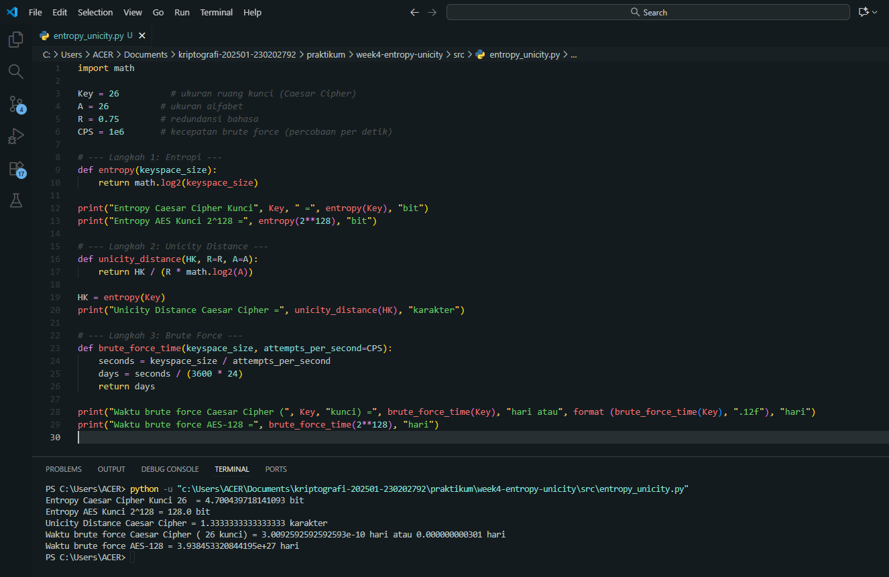

# Laporan Praktikum Kriptografi
Minggu ke-: 4  
Topik: Entropy & Unicity Distance (Evaluasi Kekuatan Kunci dan Brute Force)

Nama: Zaki Fauzan Sulton  
NIM: 230202792  
Kelas: 5IKRA  

---

## 1. Tujuan
1. Menyelesaikan perhitungan sederhana terkait entropi kunci.  
2. Menggunakan teorema Euler pada contoh perhitungan modular & invers.  
3. Menghitung **unicity distance** untuk ciphertext tertentu.  
4. Menganalisis kekuatan kunci berdasarkan entropi dan unicity distance.  
5. Mengevaluasi potensi serangan brute force pada kriptosistem sederhana.  

---

## 2. Dasar Teori
**Entropy (Entropi)** dalam kriptografi menggambarkan tingkat ketidakpastian atau kerandoman dalam pemilihan kunci. Semakin besar ruang kunci yang mungkin digunakan, semakin tinggi nilai entropinya, yang berarti semakin sulit bagi penyerang untuk menebak kunci secara benar. Rumus umum entropi adalah \( H(K) = \log_2 |K| \), di mana \(|K|\) adalah jumlah total kemungkinan kunci. Entropi menjadi indikator dasar kekuatan kriptosistem terhadap serangan brute force, karena setiap bit tambahan menggandakan jumlah kemungkinan kunci.

**Unicity Distance (Jarak Unik)** adalah ukuran jumlah minimal ciphertext yang dibutuhkan agar kunci dapat ditentukan secara unik. Diperkenalkan oleh Claude Shannon, unicity distance dihitung menggunakan rumus \( U = \frac{H(K)}{R \cdot \log_2 |A|} \), di mana \(R\) adalah redundansi bahasa dan \(|A|\) adalah ukuran alfabet. Jika ciphertext yang dikumpulkan melebihi nilai \(U\), maka secara teoritis kunci bisa dipecahkan karena informasi dalam ciphertext sudah cukup untuk mengeliminasi semua kemungkinan selain kunci yang benar.

Kedua konsep ini saling terkait dalam menilai **kekuatan kriptografi**: entropi tinggi menandakan kunci lebih acak dan sulit ditebak, sedangkan unicity distance yang besar menunjukkan cipher lebih tahan terhadap analisis statistik berbasis redundansi. Dengan demikian, sistem seperti AES dengan entropi 128 bit memiliki keamanan jauh lebih besar dibanding Caesar Cipher yang hanya memiliki entropi sekitar 4.7 bit.

---

## 3. Alat dan Bahan
(- Python 3.x  
- Visual Studio Code / editor lain  
- Git dan akun GitHub  
- Library Standar )

---

## 4. Langkah Percobaan
(langkah yang dilakukan.  
1. Membuat file `entropy_unicity.py` di folder `praktikum/week4-entropy-unicity/src/`.
2. Menyalin atau memodifikasi kode program dari panduan praktikum.
3. Menjalankan program)

---

## 5. Source Code

```python
import math

Key = 26          # ukuran ruang kunci (Caesar Cipher)
A = 26          # ukuran alfabet
R = 0.75        # redundansi bahasa
CPS = 1e6       # kecepatan brute force (percobaan per detik)

# --- Langkah 1: Entropi ---
def entropy(keyspace_size):
    return math.log2(keyspace_size)

print("Entropy Caesar Cipher Kunci", Key, " =", entropy(Key), "bit")
print("Entropy AES Kunci 2^128 =", entropy(2**128), "bit")

# --- Langkah 2: Unicity Distance ---
def unicity_distance(HK, R=R, A=A):
    return HK / (R * math.log2(A))

HK = entropy(Key)
print("Unicity Distance Caesar Cipher =", unicity_distance(HK), "karakter")

# --- Langkah 3: Brute Force ---
def brute_force_time(keyspace_size, attempts_per_second=CPS):
    seconds = keyspace_size / attempts_per_second
    days = seconds / (3600 * 24)
    return days

print("Waktu brute force Caesar Cipher (", Key, "kunci) =", brute_force_time(Key), "hari atau", format (brute_force_time(Key), ".12f"), "hari")
print("Waktu brute force AES-128 =", brute_force_time(2**128), "hari")
```
)

---

## 6. Hasil dan Pembahasan
| Komponen | Rumus | Nilai |
|-----------|--------|-------|
| Entropi Caesar | \(H(K)=\log_2 26\) | **4.700439718 bit** |
| Entropi AES-128 | \(H(K)=\log_2 2^{128}\) | **128 bit** |
| Unicity Distance Caesar | \(U=\frac{H(K)}{R\log_2 A}\) | **1.333333333 karakter** |
| Waktu Brute Force Caesar | \(\frac{26}{10^6×86400}\) hari | **3.009259259e−10 hari** atau **0.000000000301 hari** |
| Waktu Brute Force AES-128 | \(\frac{2^{128}}{10^6×86400}\) hari | **3.938453321e+27 hari** |

- Hasil sesuai teori: entropi meningkat logaritmik terhadap ukuran ruang kunci.  

Hasil eksekusi program entropy unicity:


)

---

## 7. Jawaban Pertanyaan
1. Apa arti dari nilai **entropy** dalam konteks kekuatan kunci?
   
   Nilai *entropy* menunjukkan tingkat ketidakpastian atau jumlah informasi dalam sebuah kunci. Semakin tinggi entropi, semakin besar jumlah kemungkinan kunci yang harus ditebak oleh penyerang. Dengan demikian, kunci         berentropi tinggi berarti memiliki ruang kunci yang luas dan lebih tahan terhadap serangan brute force karena probabilitas menebak kunci yang benar menjadi sangat kecil.
   
2. Mengapa unicity distance penting dalam menentukan keamanan suatu cipher?
   
   Unicity distance menunjukkan berapa banyak ciphertext yang dibutuhkan agar kunci dapat ditentukan secara unik. Jika unicity distance kecil, maka cipher lebih mudah dianalisis karena sedikit data sudah cukup untuk          menemukan kunci. Sebaliknya, unicity distance yang besar menunjukkan cipher lebih kuat, karena dibutuhkan ciphertext dalam jumlah besar sebelum analisis statistik bisa berhasil.

3. Mengapa brute force masih menjadi ancaman meskipun algoritma sudah kuat?
   
   Brute force tetap dianggap ancaman karena perkembangan teknologi komputasi terus meningkat, terutama dengan hadirnya GPU, komputasi paralel, dan bahkan riset komputasi kuantum. Walau algoritma modern seperti AES-128       sangat kuat saat ini, peningkatan kecepatan perangkat keras atau kesalahan implementasi (misalnya panjang kunci terlalu pendek atau kebocoran sebagian kunci) dapat menurunkan efektivitas keamanan dan membuka peluang       bagi serangan brute force di masa depan.
   
---

## 8. Kesimpulan
- Entropi menentukan kekuatan teoretis kunci.  
- Unicity distance mengukur panjang ciphertext minimal agar kunci bisa diidentifikasi unik.  
- Caesar Cipher sangat lemah karena ruang kunci kecil dan waktu brute force sangat singkat.  
- AES-128 tetap aman secara praktis terhadap brute force karena ruang kunci sangat besar.
  
---

## 9. Daftar Pustaka
- Stallings, W. *Cryptography and Network Security*. Bab 3

---

## 10. Commit Log
```
commit bdee0547946122f7b53c2713dbc6af2ddf092783
Author: Zaki Fauzan Sulton <a47922653@gmail.com>
Date:   Sat Oct 25 12:37:03 2025 +0700

    week4-entropy-unicity
```
