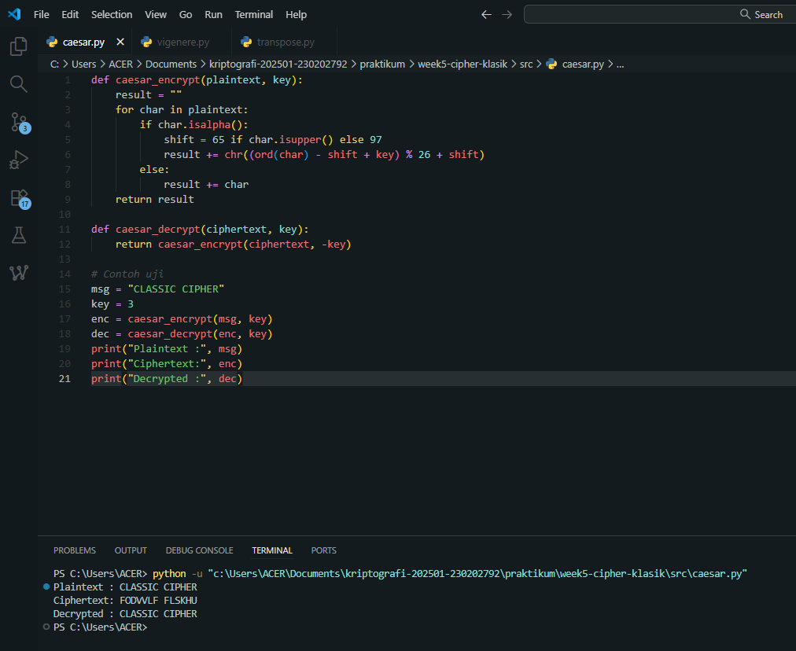
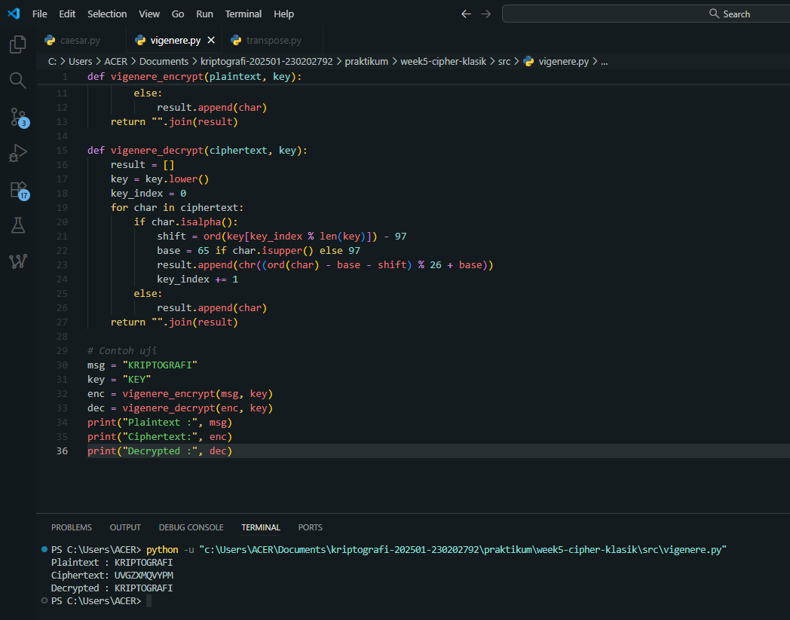
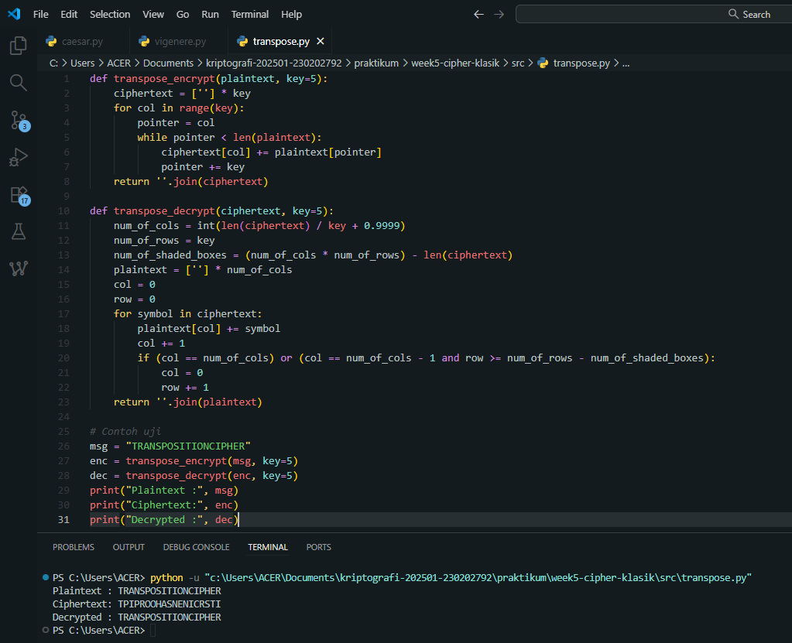

# Laporan Praktikum Kriptografi
Minggu ke-: 5  
Topik: [Cipher klasik]  
Nama: [Zaki Fauzan Sulton]  
NIM: [230202792]  
Kelas: [5IKRA]  

---

## 1. Tujuan
1. Menerapkan algoritma **Caesar Cipher** untuk enkripsi dan dekripsi teks.  
2. Menerapkan algoritma **Vigenère Cipher** dengan variasi kunci.  
3. Mengimplementasikan algoritma transposisi sederhana.  
4. Menjelaskan kelemahan algoritma kriptografi klasik.  

---

## 2. Dasar Teori
Cipher klasik adalah metode kriptografi fundamental yang digunakan sebelum era komputer, umumnya bekerja pada tingkat alfabet. Metode ini terbagi menjadi dua kategori utama: substitusi (penggantian) dan transposisi (pemindahan posisi). **Caesar Cipher** adalah contoh substitusi monoalfabetik yang paling sederhana. Cara kerjanya adalah dengan **menggeser** setiap huruf dalam teks asli (plaintext) sejauh jumlah posisi tetap dalam alfabet (misalnya, geser 3, A menjadi D). Kunci dari cipher ini adalah angka pergeseran tersebut. Kelemahan utamanya adalah sangat rentan terhadap **analisis frekuensi**, karena setiap huruf plaintext selalu dipetakan ke huruf ciphertext yang sama.

Untuk mengatasi kelemahan Caesar, **Vigenère Cipher** diperkenalkan sebagai cipher substitusi polialfabetik. Alih-alih menggunakan satu pergeseran tetap, Vigenère menggunakan **kata kunci** (key). Setiap huruf pada kata kunci menentukan pergeseran Caesar yang berbeda untuk huruf-huruf plaintext secara berurutan. Misalnya, jika kuncinya "KEY", huruf pertama plaintext digeser berdasarkan 'K', kedua berdasarkan 'E', dan ketiga berdasarkan 'Y', lalu pola kunci diulang. Hal ini **menyebarkan frekuensi** huruf, membuat analisis frekuensi sederhana tidak efektif karena huruf plaintext yang sama (misal 'E') dapat dienkripsi menjadi huruf ciphertext yang berbeda-beda tergantung posisinya.

Berbeda dari substitusi, **Cipher Transposisi** tidak mengubah huruf-huruf itu sendiri, melainkan **mengatur ulang posisinya**. Dalam metode ini, plaintext ditulis dalam pola tertentu (seringkali dalam bentuk grid atau matriks) berdasarkan sebuah kunci (misalnya, urutan kolom). Ciphertext kemudian dibaca dengan urutan yang berbeda dari cara penulisannya (misal, dibaca per kolom berdasarkan urutan alfabet kuncinya). Hasilnya adalah anagram dari teks aslinya; frekuensi huruf dalam ciphertext sama persis dengan plaintext, namun urutannya diacak sehingga tidak dapat dibaca.

---

## 3. Alat dan Bahan
(- Python 3.11  
- Visual Studio Code / editor lain  
- Git dan akun GitHub  
- Library standar  )

---

## 4. Langkah Percobaan
1. Membuat file `caesar_cipher.py` di folder `praktikum/week5-cipher-klasik/src/`.
2. Menyalin kode program dari panduan praktikum.
3. Menjalankan program dengan perintah `python caesar_cipher.py`.)

---

## 5. Source Code
Caesar
```python
def caesar_encrypt(plaintext, key):
    result = ""
    for char in plaintext:
        if char.isalpha():
            shift = 65 if char.isupper() else 97
            result += chr((ord(char) - shift + key) % 26 + shift)
        else:
            result += char
    return result

def caesar_decrypt(ciphertext, key):
    return caesar_encrypt(ciphertext, -key)

# Contoh uji
msg = "CLASSIC CIPHER"
key = 3
enc = caesar_encrypt(msg, key)
dec = caesar_decrypt(enc, key)
print("Plaintext :", msg)
print("Ciphertext:", enc)
print("Decrypted :", dec)
```
Vigenere
```python
def vigenere_encrypt(plaintext, key):
    result = []
    key = key.lower()
    key_index = 0
    for char in plaintext:
        if char.isalpha():
            shift = ord(key[key_index % len(key)]) - 97
            base = 65 if char.isupper() else 97
            result.append(chr((ord(char) - base + shift) % 26 + base))
            key_index += 1
        else:
            result.append(char)
    return "".join(result)

def vigenere_decrypt(ciphertext, key):
    result = []
    key = key.lower()
    key_index = 0
    for char in ciphertext:
        if char.isalpha():
            shift = ord(key[key_index % len(key)]) - 97
            base = 65 if char.isupper() else 97
            result.append(chr((ord(char) - base - shift) % 26 + base))
            key_index += 1
        else:
            result.append(char)
    return "".join(result)

# Contoh uji
msg = "KRIPTOGRAFI"
key = "KEY"
enc = vigenere_encrypt(msg, key)
dec = vigenere_decrypt(enc, key)
print("Plaintext :", msg)
print("Ciphertext:", enc)
print("Decrypted :", dec)
```
Transpose
```python
def transpose_encrypt(plaintext, key=5):
    ciphertext = [''] * key
    for col in range(key):
        pointer = col
        while pointer < len(plaintext):
            ciphertext[col] += plaintext[pointer]
            pointer += key
    return ''.join(ciphertext)

def transpose_decrypt(ciphertext, key=5):
    num_of_cols = int(len(ciphertext) / key + 0.9999)
    num_of_rows = key
    num_of_shaded_boxes = (num_of_cols * num_of_rows) - len(ciphertext)
    plaintext = [''] * num_of_cols
    col = 0
    row = 0
    for symbol in ciphertext:
        plaintext[col] += symbol
        col += 1
        if (col == num_of_cols) or (col == num_of_cols - 1 and row >= num_of_rows - num_of_shaded_boxes):
            col = 0
            row += 1
    return ''.join(plaintext)

# Contoh uji
msg = "TRANSPOSITIONCIPHER"
enc = transpose_encrypt(msg, key=5)
dec = transpose_decrypt(enc, key=5)
print("Plaintext :", msg)
print("Ciphertext:", enc)
print("Decrypted :", dec)
```

---

## 6. Hasil dan Pembahasan

Hasil eksekusi program Caesar:

Screenshot menunjukkan plaintext 'CLASSIC CIPHER' dengan kunci 3 dienkripsi menjadi 'FODVULF FLSKHU'. Ini sesuai dengan teori pergeseran 3 huruf (C->F, L->O, dst.) dan proses dekripsinya berhasil mengembalikan ke plaintext asli.

---
Hasil eksekusi program Vigenere:

Plaintext 'KRIPTOGRAFI' dengan kunci 'KEY' dienkripsi menjadi 'UVGZXMQVYPM'. Hasil ini konsisten dengan penggunaan kunci polialfabetik: huruf pertama ('K') digeser oleh 'K' (menjadi U), huruf kedua ('R') oleh 'E' (menjadi V), huruf ketiga ('I') oleh 'Y' (menjadi G), dan pola kunci berulang. Dekripsi berhasil, menunjukkan implementasi yang benar.

---
Hasil eksekusi program Transpose:

Plaintext 'TRANSPOSITIONCIPHER' dengan kunci 5 (jumlah kolom) dienkripsi menjadi 'TPIPROOHASNENICRSTI'. Hasil ini didapat dengan menulis plaintext dalam grid 5 kolom dan membacanya secara vertikal per kolom (Kolom 1: TPIP, Kolom 2: ROOH, dst.). Proses dekripsi yang sukses membuktikan logika penulisan dan pembacaan matriks telah benar.

---

## 7. Jawaban Pertanyaan
1. Apa kelemahan utama algoritma Caesar Cipher dan Vigenère Cipher?

* **Caesar Cipher:** Kelemahan utamanya ada dua. Pertama, ia adalah **substitusi monoalfabetik**, yang berarti setiap huruf plaintext (misal 'A') selalu dipetakan ke huruf ciphertext yang sama (misal 'D'). Ini membuatnya sangat rentan terhadap **analisis frekuensi**; penyerang tinggal menghitung huruf mana yang paling sering muncul di ciphertext dan menebaknya sebagai huruf yang paling umum dalam bahasa tersebut (seperti 'A' atau 'E'). Kedua, **ruang kuncinya sangat kecil** (hanya ada 25 kemungkinan pergeseran dalam alfabet Latin), sehingga mudah dipecahkan dengan *brute force* (mencoba semua kemungkinan kunci).

* **Vigenère Cipher:** Kelemahan utamanya adalah **sifatnya yang periodik (mengulang)**. Meskipun Vigenère adalah polialfabetik dan menyebarkan frekuensi huruf, penggunaan kata kunci yang berulang menciptakan pola. Jika kata kuncinya "KEY" (panjang 3), maka setiap huruf ke-1, ke-4, ke-7, dst., semuanya dienkripsi dengan kunci 'K'. Penyerang dapat mengeksploitasi ini menggunakan metode seperti *Ujian Kasiski* (mencari urutan ciphertext yang berulang) atau *Indeks Koinsidensi* untuk menebak panjang kuncinya. Setelah panjang kunci diketahui, penyerang dapat membagi ciphertext menjadi beberapa bagian, yang masing-masingnya hanyalah Caesar Cipher sederhana yang dapat dipecahkan dengan analisis frekuensi.

---

2. Mengapa cipher klasik mudah diserang dengan analisis frekuensi?

Cipher klasik (terutama cipher substitusi) mudah diserang dengan analisis frekuensi karena mereka **gagal menyembunyikan properti statistik bahasa asli** (plaintext).

Setiap bahasa memiliki "sidik jari" statistik yang unik. Misalnya, dalam bahasa Inggris, huruf 'E' adalah yang paling umum, diikuti oleh 'T', 'A', 'O', dst. Dalam bahasa Indonesia, 'A' adalah yang paling umum, diikuti oleh 'E', 'N', 'I', 'U'.

* Pada **cipher monoalfabetik** (seperti Caesar), pemetaan ini tetap. Jika 'A' (paling umum di Indonesia) dienkripsi menjadi 'K', maka 'K' akan menjadi huruf yang paling umum di ciphertext. Seorang analis kripto hanya perlu menghitung frekuensi huruf di ciphertext untuk menebak pemetaan kuncinya.

* Pada **cipher polialfabetik** (seperti Vigenère), serangan ini lebih sulit tetapi tidak mustahil. Seperti dijelaskan di atas, sifat periodik dari kuncinya memungkinkan penyerang untuk memecah masalah menjadi beberapa analisis frekuensi yang lebih kecil.

---

3. Bandingkan kelebihan dan kelemahan cipher substitusi vs transposisi.

Cipher substitusi dan transposisi adalah dua kategori utama cipher klasik, dan mereka memiliki perbedaan fundamental dalam cara kerja dan keamanannya.

| Fitur | Cipher Substitusi (e.g., Caesar, Vigenère) | Cipher Transposisi (e.g., Rail Fence, Kolom) |
| :--- | :--- | :--- |
| **Cara Kerja** | **Mengganti** huruf dengan huruf atau simbol lain. | **Mengubah posisi** (mengacak) urutan huruf. |
| **Identitas Huruf** | Huruf di ciphertext **berbeda** dari plaintext. | Huruf di ciphertext **sama** dengan di plaintext. |
| **Kelebihan** | Dapat **menyembunyikan frekuensi** huruf asli (terutama Vigenère), membuat ciphertext terlihat sangat acak. | Secara inheren **tahan terhadap analisis frekuensi sederhana** (karena frekuensi huruf tidak berubah, penyerang tidak tahu 'X' itu 'A'). |
| **Kelemahan** | **Sangat rentan terhadap analisis frekuensi** (jika monoalfabetik) atau analisis statistik yang lebih canggih (jika polialfabetik). | **Sangat rentan terhadap analisis anagram**. Penyerang tahu persis huruf apa saja yang ada di plaintext. |
| **Cara Serangan** | Menghitung frekuensi huruf, mencari pola kunci (Kasiski). | Mencari pola pengacakan (anagramming), menganalisis pasangan huruf (digram) atau trigram yang umum (misal, 'TH' 'ING'). |
| **Contoh Hasil** | "HELLO" bisa menjadi "KHOOR" (Substitusi). | "HELLO" bisa menjadi "HLOEL" (Transposisi). |
---

## 8. Kesimpulan
Praktikum ini berhasil mengimplementasikan algoritma Caesar, Vigenère, dan Transposisi. Hasil analisis mengonfirmasi bahwa cipher klasik, meskipun Vigenère lebih kuat dari Caesar, pada dasarnya tetap rentan karena gagal menyembunyikan properti statistik bahasa (seperti frekuensi huruf) dari serangan analisis.

---

## 9. Daftar Pustaka
- Materi rujukan: Stallings (2017), Bab 3. 
- Stallings, W. *Cryptography and Network Security*.  )

---

## 10. Commit Log

```
commit 037561897d836c13b2bab93adb29c0da4a8d4314
Author: Zaki Fauzan Sulton <a47922653@gmail.com>
Date:   Fri Oct 31 13:43:58 2025 +0700

    week5-cipher-klasik
```
