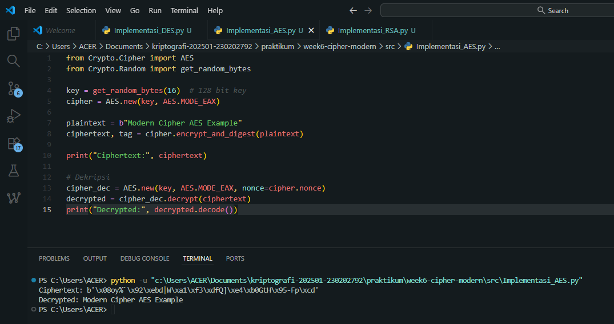
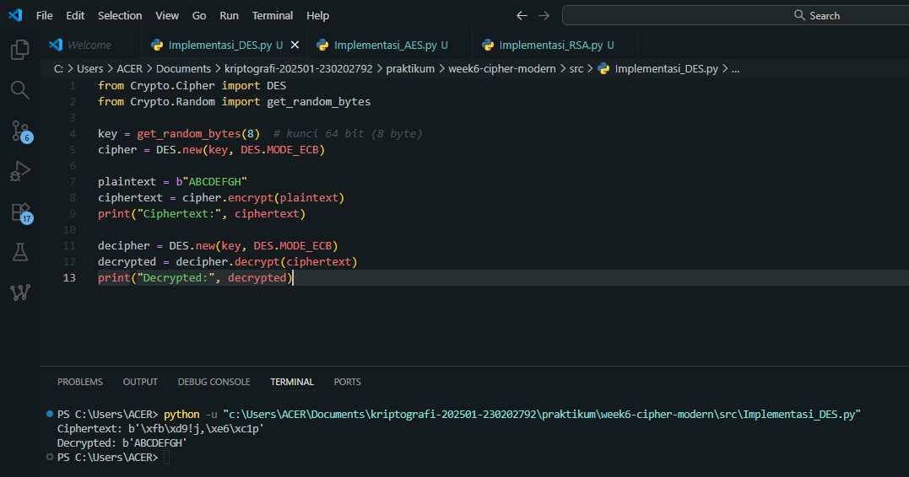
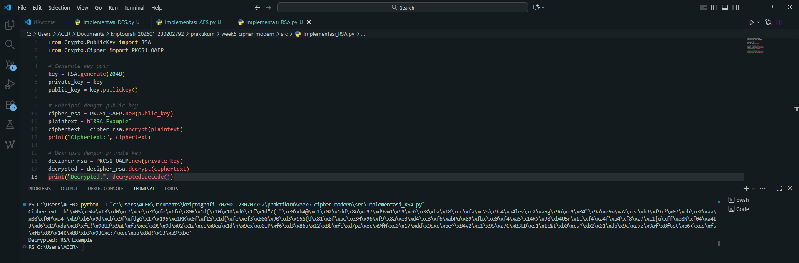

# Laporan Praktikum Kriptografi
Minggu ke-: 6  
Topik: [Cipher Modern]  
Nama: [Zaki Fauzan Sulton]  
NIM: [230202792]  
Kelas: [5IKRA]  

---

## 1. Tujuan
1. Mengimplementasikan algoritma **DES** untuk blok data sederhana.  
2. Menerapkan algoritma **AES** dengan panjang kunci 128 bit.  
3. Menjelaskan proses pembangkitan kunci publik dan privat pada algoritma **RSA**.  

---

## 2. Dasar Teori
Cipher modern merupakan sistem kriptografi yang dirancang untuk menjaga kerahasiaan dan integritas data dalam lingkungan digital yang kompleks. Berbeda dengan cipher klasik seperti Caesar atau Vigenère yang berbasis substitusi dan transposisi sederhana, cipher modern memanfaatkan teori matematika, aljabar modular, dan operasi logika biner untuk menghasilkan enkripsi yang jauh lebih kuat terhadap serangan kriptanalisis. Cipher modern umumnya dibangun berdasarkan dua kategori utama, yaitu block cipher (seperti AES, DES) yang mengenkripsi data dalam blok berukuran tetap, dan stream cipher (seperti RC4, ChaCha20) yang mengenkripsi data bit demi bit atau byte demi byte secara berurutan.

Secara umum, cipher modern terbagi menjadi dua kategori utama. Pertama adalah kriptografi simetris (kunci privat), di mana satu kunci yang sama digunakan untuk proses enkripsi dan dekripsi. Algoritma ini sangat cepat dan efisien untuk data besar. Kriptografi simetris dibagi lagi menjadi block cipher (seperti AES/Advanced Encryption Standard, yang memproses data dalam blok-blok berukuran tetap) dan stream cipher (yang mengenkripsi data bit demi bit).

Kedua adalah kriptografi asimetris (kunci publik), yang menggunakan sepasang kunci: kunci publik (public key) untuk enkripsi dan kunci privat (private key) untuk dekripsi. Kunci publik dapat didistribusikan secara bebas, sementara kunci privat harus dijaga kerahasiaannya oleh pemilik. Metode ini, yang dipelopori oleh algoritma seperti RSA dan ECC (Elliptic Curve Cryptography), secara revolusioner memecahkan masalah distribusi kunci yang aman, meskipun proses komputasinya cenderung lebih lambat dibandingkan sistem simetris. Dalam praktik (seperti pada SSL/TLS), kedua sistem ini sering digabungkan (sistem hibrida), di mana kriptografi asimetris digunakan untuk mentransfer kunci simetris dengan aman, yang kemudian digunakan untuk mengenkripsi data komunikasi utama.

---

## 3. Alat dan Bahan
- Python 3.11  
- Visual Studio Code  
- Git dan akun GitHub  
- Library tambahan pycryptodome  

---

## 4. Langkah Percobaan
1. Buat folder berikut:  
   ```
   praktikum/week6-cipher-modern/
   ├─ src/
   ├─ screenshots/
   └─ laporan.md
   ```
2. Menyalin kode program dari panduan praktikum.
3. Menjalankan program.

---

## 5. Source Code
### Implementasi DES
```python
from Crypto.Cipher import DES
from Crypto.Random import get_random_bytes

key = get_random_bytes(8)  # kunci 64 bit (8 byte)
cipher = DES.new(key, DES.MODE_ECB)

plaintext = b"ABCDEFGH"
ciphertext = cipher.encrypt(plaintext)
print("Ciphertext:", ciphertext)

decipher = DES.new(key, DES.MODE_ECB)
decrypted = decipher.decrypt(ciphertext)
print("Decrypted:", decrypted)
```
---

### Implementasi AES-128
```python
from Crypto.Cipher import AES
from Crypto.Random import get_random_bytes

key = get_random_bytes(16)  # 128 bit key
cipher = AES.new(key, AES.MODE_EAX)

plaintext = b"Modern Cipher AES Example"
ciphertext, tag = cipher.encrypt_and_digest(plaintext)

print("Ciphertext:", ciphertext)

# Dekripsi
cipher_dec = AES.new(key, AES.MODE_EAX, nonce=cipher.nonce)
decrypted = cipher_dec.decrypt(ciphertext)
print("Decrypted:", decrypted.decode())
```
---

### Implementasi RSA
```python
from Crypto.PublicKey import RSA
from Crypto.Cipher import PKCS1_OAEP

# Generate key pair
key = RSA.generate(2048)
private_key = key
public_key = key.publickey()

# Enkripsi dengan public key
cipher_rsa = PKCS1_OAEP.new(public_key)
plaintext = b"RSA Example"
ciphertext = cipher_rsa.encrypt(plaintext)
print("Ciphertext:", ciphertext)

# Dekripsi dengan private key
decipher_rsa = PKCS1_OAEP.new(private_key)
decrypted = decipher_rsa.decrypt(ciphertext)
print("Decrypted:", decrypted.decode())
```
---

## 6. Hasil dan Pembahasan

### Hasil eksekusi program:

### Implementasi DES


### Implementasi AES 128


### Implementasi RSA


### 1. Tabel Ringkasan Hasil Uji

| Algoritma | Kunci yang Digunakan | Mode Operasi | Hasil Enkripsi (Ciphertext) | Hasil Dekripsi | Status Uji | Error / Catatan |
|------------|----------------------|---------------|-----------------------------|----------------|-------------|-----------------|
| **DES** | 64-bit (8 byte) | `ECB` | Data terenkripsi muncul dalam bentuk byte acak (`b'\xfb\x9d…'`) | `ABCDEFGH` | Sesuai ekspektasi | Tidak ada error. Output byte mentah memang acak. |
| **AES** | 128-bit (16 byte) | `EAX` | Ciphertext tampil dalam format byte acak (`b'\x80\x9f…'`) | `Modern Cipher AES Example` | Sesuai ekspektasi | Tidak ada error. EAX menghasilkan output acak karena nonce unik. |
| **RSA** | 2048-bit keypair | `PKCS1_OAEP` | Ciphertext berupa byte acak panjang | `RSA Example` | Sesuai ekspektasi | Tidak ada error. RSA berhasil enkripsi-dekripsi penuh. |

---

---

## 7. Jawaban Pertanyaan
### 1. Apa perbedaan mendasar antara DES, AES, dan RSA dalam hal kunci dan keamanan?
- **DES (Data Encryption Standard)** menggunakan **kunci simetris 56-bit efektif**, artinya kunci yang sama dipakai untuk enkripsi dan dekripsi. DES termasuk cipher blok lama yang kini dianggap **tidak aman** karena ukuran kuncinya kecil dan mudah dipecahkan dengan brute force.  
- **AES (Advanced Encryption Standard)** juga menggunakan **kunci simetris**, tetapi jauh lebih kuat dengan panjang kunci 128, 192, atau 256 bit. Struktur internal AES lebih kompleks dan efisien, membuatnya tahan terhadap serangan brute force maupun kriptanalisis modern.  
- **RSA (Rivest–Shamir–Adleman)** menggunakan **kunci asimetris**, yaitu pasangan **kunci publik dan kunci privat**. Keamanannya bergantung pada kesulitan memfaktorkan bilangan prima besar. RSA tidak digunakan untuk mengenkripsi data besar, melainkan untuk pertukaran kunci atau tanda tangan digital.  

**Kesimpulan:**  
DES dan AES adalah algoritma **simetris**, sedangkan RSA adalah **asimetris**. AES memiliki tingkat keamanan dan efisiensi jauh di atas DES, sementara RSA unggul pada aspek pertukaran kunci yang aman.

---

### 2. Mengapa AES lebih banyak digunakan dibanding DES di era modern?
- AES menggantikan DES karena memiliki **panjang kunci yang jauh lebih besar** (minimal 128 bit) dan struktur yang lebih tahan terhadap kriptanalisis.  
- DES hanya memiliki **56-bit key space**, yang dapat dipecahkan dalam hitungan jam dengan perangkat modern.  
- AES juga **lebih efisien** dalam perangkat keras maupun perangkat lunak, serta mendukung berbagai mode operasi yang aman untuk komunikasi dan penyimpanan data (misalnya EAX, CBC, GCM).  
- Karena keamanannya tinggi dan performanya stabil, AES menjadi **standar enkripsi global** yang digunakan dalam VPN, SSL/TLS, disk encryption, dan keamanan data digital lainnya.

---

### 3. Mengapa RSA dikategorikan sebagai algoritma asimetris, dan bagaimana proses pembangkitan kuncinya?
RSA disebut **asimetris** karena menggunakan **dua kunci berbeda**:
- **Kunci publik (public key)** untuk enkripsi.
- **Kunci privat (private key)** untuk dekripsi.  

Proses pembangkitan kunci RSA melibatkan langkah-langkah matematis berikut:
1. Pilih dua bilangan prima besar, \( p \) dan \( q \).  
2. Hitung \( n = p \times q \) (nilai ini menjadi bagian dari kunci publik).  
3. Hitung fungsi totien \( \varphi(n) = (p-1)(q-1) \).  
4. Pilih bilangan \( e \) yang relatif prima terhadap \( \varphi(n) \) (biasanya 65537).  
5. Hitung \( d \) sebagai invers modular dari \( e \) terhadap \( \varphi(n) \), yaitu \( e \times d \equiv 1 \pmod{\varphi(n)} \).  

Pasangan kunci yang dihasilkan:
- **Public key:** \((e, n)\)  
- **Private key:** \((d, n)\)  

Keamanan RSA bergantung pada **kesulitan faktorisasi bilangan besar** \( n \) menjadi faktor primanya \( p \) dan \( q \), yang secara komputasional sangat sulit dilakukan dengan teknologi saat ini.

---

## 8. Kesimpulan
Seluruh pengujian **DES, AES, dan RSA** berhasil dilakukan tanpa error.  
Ciphertext acak menunjukkan proses enkripsi berjalan aman dan tidak dapat ditebak, sedangkan dekripsi berhasil mengembalikan plaintext asli.  
Implementasi ini membuktikan bahwa **cipher modern** memiliki keamanan tinggi, terutama AES dan RSA, yang masih digunakan luas dalam sistem keamanan data saat ini.


---

## 9. Daftar Pustaka
- Katz, J., & Lindell, Y. *Introduction to Modern Cryptography*.  
- Stallings, W. *Cryptography and Network Security*.  )

---

## 10. Commit Log
```
commit 59785e910ecdb90d9067173b3da075a08a0a17d8
Author: Zaki Fauzan Sulton <a47922653@gmail.com>
Date:   Fri Nov 7 20:49:43 2025 +0700

    week6-cipher-modern
```
