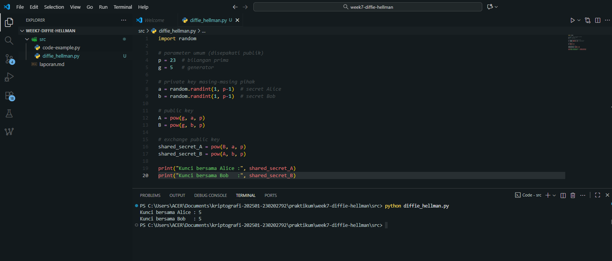

# Laporan Praktikum Kriptografi
Minggu ke-: 7  
Topik: Diffie Hellman  
Nama: Zaki Fauzan Sulton  
NIM: 230202792  
Kelas: 5IKRA  

---

## 1. Tujuan
1. Melakukan simulasi protokol **Diffie-Hellman** untuk pertukaran kunci publik.  
2. Menjelaskan mekanisme pertukaran kunci rahasia menggunakan bilangan prima dan logaritma diskrit.  
3. Menganalisis potensi serangan pada protokol Diffie-Hellman (termasuk serangan **Man-in-the-Middle / MITM**).

---

## 2. Dasar Teori
Diffie–Hellman adalah protokol pertukaran kunci yang memungkinkan dua pihak menghasilkan kunci rahasia bersama melalui jalur komunikasi yang tidak aman. Keduanya sepakat pada dua nilai publik (modulus prima p dan generator g), lalu masing-masing memilih angka rahasia pribadi. Dengan melakukan operasi perpangkatan modular, mereka bertukar nilai publik hasil perhitungan dan akhirnya dapat menghitung kunci rahasia yang sama tanpa pernah mengirimkan kunci tersebut secara langsung.

Keamanan Diffie–Hellman bergantung pada sulitnya menyelesaikan Discrete Logarithm Problem (DLP), yaitu menebak eksponen rahasia dari hasil perpangkatan modular. Selama nilai p cukup besar dan dipilih dengan benar, kunci bersama sangat sulit direkonstruksi oleh pihak ketiga. Protokol ini digunakan secara luas dalam TLS/HTTPS untuk menghasilkan kunci sesi yang aman dan mendukung Perfect Forward Secrecy, memastikan kerahasiaan komunikasi tetap terjaga meskipun kunci jangka panjang kemudian bocor.

---

## 3. Alat dan Bahan
- Python 3.11  
- Visual Studio Code / editor lain  
- Git dan akun GitHub  
- Library standar

---

## 4. Langkah Percobaan
1. Membuat file `diffie_hellman.py` di folder `praktikum/week7-diffie_hellman/src/`.
2. Menyalin kode program dari panduan praktikum.
3. Menjalankan program dengan perintah

---

## 5. Source Code

```python
import random

# parameter umum (disepakati publik)
p = 23  # bilangan prima
g = 5   # generator

# private key masing-masing pihak
a = random.randint(1, p-1)  # secret Alice
b = random.randint(1, p-1)  # secret Bob

# public key
A = pow(g, a, p)
B = pow(g, b, p)

# exchange public key
shared_secret_A = pow(B, a, p)
shared_secret_B = pow(A, b, p)

print("Kunci bersama Alice :", shared_secret_A)
print("Kunci bersama Bob   :", shared_secret_B)
```

Ekspektasi hasil: nilai `shared_secret_A` dan `shared_secret_B` harus sama.

---

## 6. Hasil dan Pembahasan
### Hasil eksekusi program Diffie-Hellman:



### Hasil yang diperoleh sesuai dengan ekspektasi dimana nilai `shared_secret_A` dan `shared_secret_B` sama.

---

## 7. Jawaban Pertanyaan
1. Mengapa Diffie–Hellman bisa digunakan di saluran publik?

   Karena yang ditukar hanya nilai publik (gᵃ mod p dan gᵇ mod p), sementara kunci rahasia dihitung secara terpisah. Penyadap tidak bisa mendapatkan eksponen rahasia karena harus menyelesaikan Discrete Logarithm Problem yang sangat sulit.

3. Kelemahan utama Diffie–Hellman murni?

   Tidak ada autentikasi, sehingga sangat rentan terhadap serangan Man-in-the-Middle (MITM).

5. Cara mencegah MITM?

   Menambahkan autentikasi, misalnya dengan tanda tangan digital, sertifikat TLS, atau protokol versi terautentikasi seperti ECDHE.

---

## 8. Kesimpulan
Berdasarkan percobaan implementasi protokol Diffie-Hellman, terbukti bahwa kedua pihak (Alice dan Bob) dapat menghasilkan kunci rahasia bersama yang sama meskipun hanya bertukar nilai publik melalui saluran yang tidak aman. Hal ini menunjukkan bahwa mekanisme perpangkatan modular dan pemilihan bilangan prima serta generator yang sesuai memungkinkan pembentukan kunci bersama tanpa perlu mengirimkan kunci rahasia secara langsung.

---

## 9. Daftar Pustaka
- Stallings, W. *Cryptography and Network Security*.  )

---

## 10. Commit Log

```
commit c903ed982141a772864c2b13f6b7189b558c7374
Author: Zaki Fauzan Sulton <a47922653@gmail.com>
Date:   Tue Nov 18 18:24:11 2025 +0700

    week7-diffie-hellman

```
