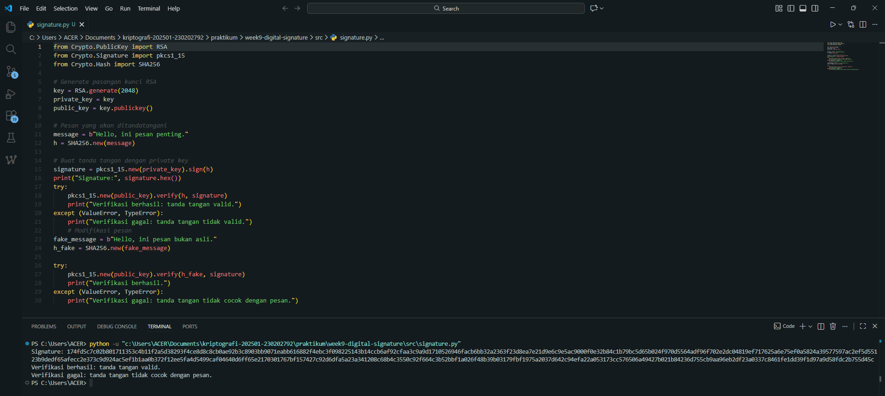

# Laporan Praktikum Kriptografi
Minggu ke-: 9  
Topik: Digital Signature  
Nama: Zaki Fauzan Sulton  
NIM: 230202792  
Kelas: 5IKRA  

---

## 1. Tujuan
1. Mengimplementasikan tanda tangan digital menggunakan algoritma RSA/DSA.  
2. Memverifikasi keaslian tanda tangan digital.  
3. Menjelaskan manfaat tanda tangan digital dalam otentikasi pesan dan integritas data.  

---

## 2. Dasar Teori
Tanda tangan digital adalah mekanisme matematis yang digunakan untuk memverifikasi keaslian dan integritas pesan, perangkat lunak, atau dokumen digital. Berbeda dengan tanda tangan fisik, yang merupakan representasi visual identitas, tanda tangan digital adalah kode terenkripsi yang berfungsi sebagai bukti elektronik dari otentikasi. Proses ini biasanya melibatkan penggunaan infrastruktur kunci publik (PKI) dan didasarkan pada kriptografi asimetris. Ketika penanda tangan menandatangani dokumen, sistem akan membuat "hash" dokumen tersebut, yang merupakan ringkasan unik berukuran tetap, dan kemudian mengenkripsi hash ini menggunakan kunci privat (private key) penanda tangan. Hasil dari enkripsi ini adalah tanda tangan digital itu sendiri.

Tanda tangan digital sangat penting dalam perdagangan elektronik dan komunikasi aman karena menawarkan tiga layanan keamanan kriptografi utama: otentikasi (memastikan identitas penanda tangan), integritas (memastikan dokumen tidak diubah setelah ditandatangani), dan non-repudiasi (mencegah penanda tangan menyangkal bahwa mereka menandatangani dokumen tersebut). Penerima dokumen menggunakan kunci publik (public key) penanda tangan untuk mendekripsi tanda tangan, mendapatkan hash asli, dan kemudian membuat hash dokumen yang diterima. Jika kedua nilai hash ini cocok, maka otentikasi dan integritas dokumen berhasil diverifikasi. Tanda tangan digital yang sah secara hukum sering kali dianggap setara dengan tanda tangan tangan dalam banyak yurisdiksi di seluruh dunia.

---

## 3. Alat dan Bahan
(- Python 3.x  
- Visual Studio Code / editor lain  
- Git dan akun GitHub  
- Library tambahan (misalnya pycryptodome, jika diperlukan)  )

---

## 4. Langkah Percobaan
Tuliskan langkah yang dilakukan sesuai instruksi.  

1. Membuat file `signature.py` di folder `praktikum/week9-digital-signature/src/`.
2. Menyalin kode program dari panduan praktikum.
3. Menjalankan program.

---

## 5. Source Code

```python
from Crypto.PublicKey import RSA
from Crypto.Signature import pkcs1_15
from Crypto.Hash import SHA256

# Generate pasangan kunci RSA
key = RSA.generate(2048)
private_key = key
public_key = key.publickey()

# Pesan yang akan ditandatangani
message = b"Hello, ini pesan penting."
h = SHA256.new(message)

# Buat tanda tangan dengan private key
signature = pkcs1_15.new(private_key).sign(h)
print("Signature:", signature.hex())
try:
    pkcs1_15.new(public_key).verify(h, signature)
    print("Verifikasi berhasil: tanda tangan valid.")
except (ValueError, TypeError):
    print("Verifikasi gagal: tanda tangan tidak valid.")
    # Modifikasi pesan
fake_message = b"Hello, ini pesan bukan asli."
h_fake = SHA256.new(fake_message)

try:
    pkcs1_15.new(public_key).verify(h_fake, signature)
    print("Verifikasi berhasil.")
except (ValueError, TypeError):
    print("Verifikasi gagal: tanda tangan tidak cocok dengan pesan.")
```

---

## 6. Hasil dan Pembahasan
### Hasil Eksperimen Tanda Tangan Digital RSA

Eksperimen ini mengimplementasikan skema Tanda Tangan Digital menggunakan modul **Crypto** Python, memanfaatkan algoritma **RSA** (2048-bit) dan fungsi *hash* **SHA256**.

Tiga tahap eksekusi dilakukan: Penandatanganan, Verifikasi Sukses (menggunakan pesan asli), dan Verifikasi Gagal (menggunakan pesan yang dimodifikasi).

## Ringkasan Hasil Eksekusi

| Tahap | Kunci yang Digunakan | Pesan Masukan | Hasil Verifikasi |
| :--- | :--- | :--- | :--- |
| 1. **Penandatanganan** | Private Key ($\text{SK}$) | "Hello, ini pesan penting." | Menghasilkan Tanda Tangan ($\sigma$) |
| 2. **Verifikasi Sukses** | Public Key ($\text{PK}$) | Pesan Asli ($M$) | **"Verifikasi berhasil: tanda tangan valid."** |
| 3. **Verifikasi Gagal** | Public Key ($\text{PK}$) | Pesan Modifikasi ($M'$) | **"Verifikasi gagal: tanda tangan tidak cocok dengan pesan."** |

## Pembahasan Singkat Hasil

Hasil eksperimen secara langsung memvalidasi dua pilar keamanan Tanda Tangan Digital:

1.  **Otentikasi dan Non-Repudiation:** Keberhasilan pada Tahap 2 menegaskan bahwa kunci publik ($\text{PK}$) berhasil memverifikasi tanda tangan yang dibuat oleh pasangan kunci privat ($\text{SK}$) yang benar. Ini menjamin keaslian sumber.
2.  **Integritas Data:** Kegagalan pada Tahap 3 membuktikan bahwa skema ini sangat sensitif terhadap perubahan data. Ketika pesan diubah (bahkan sedikit), *hash* yang baru dihitung ($H(M')$) tidak cocok dengan *hash* asli yang terenkripsi dalam $\sigma$. Hal ini secara efektif mencegah modifikasi data secara ilegal setelah ditandatangani.

Hasil eksekusi program signature:



---

## 7. Jawaban Pertanyaan
### 1. Apa perbedaan utama antara enkripsi RSA dan tanda tangan digital RSA?

| Fitur | Enkripsi RSA | Tanda Tangan Digital RSA |
| :--- | :--- | :--- |
| **Tujuan Utama** | Mencapai **Kerahasiaan** (Confidentiality) data. | Mencapai **Otentikasi & Integritas**. |
| **Aksi Kunci Privat ($\text{SK}$)** | Digunakan oleh **Penerima** untuk **Mendekripsi** pesan. | Digunakan oleh **Pengirim** untuk **Menandatangani** (*Hash*). |
| **Aksi Kunci Publik ($\text{PK}$)** | Digunakan oleh **Pengirim** untuk **Mengenkripsi** pesan. | Digunakan oleh **Penerima** untuk **Memverifikasi** tanda tangan. |

### 2. Mengapa tanda tangan digital menjamin integritas dan otentikasi pesan?

* **Integritas:** Karena proses penandatanganan melibatkan **Hash Kriptografis** dari pesan ($H(M)$). Jika pesan diubah, bahkan sedikit, *hash* yang dihitung ulang oleh penerima tidak akan cocok dengan *hash* yang diekstrak dari tanda tangan ($\sigma$). 
* **Otentikasi:** Hanya pemilik sah dari **Kunci Privat** yang dapat menghasilkan tanda tangan yang valid yang dapat diverifikasi oleh **Kunci Publik** yang sesuai. Keberhasilan verifikasi membuktikan bahwa tanda tangan berasal dari entitas yang diklaim.

### 3. Bagaimana peran Certificate Authority (CA) dalam sistem tanda tangan digital modern?

Peran CA (Certificate Authority) sangat krusial dalam membangun **kepercayaan** publik (Public Key Infrastructure / PKI):

* **Verifikasi Identitas:** CA memverifikasi identitas entitas (orang atau organisasi) di dunia nyata.
* **Penerbitan Sertifikat:** CA mengeluarkan **Sertifikat Kunci Publik (PKC)**, yang merupakan Kunci Publik pengirim yang telah diverifikasi dan **ditandatangani** oleh CA.
* **Dasar Kepercayaan:** CA bertindak sebagai pihak ketiga tepercaya. Penerima memverifikasi tanda tangan dengan memeriksa bahwa kunci tersebut disahkan oleh CA yang tepercaya, membentuk **Rantai Kepercayaan (Chain of Trust)**.
---

## 8. Kesimpulan
Praktikum ini menyimpulkan bahwa implementasi Tanda Tangan Digital RSA/SHA256 berhasil menegakkan prinsip otentikasi dan integritas data dalam komunikasi digital. Keberhasilan dan kegagalan verifikasi secara definitif membuktikan bahwa tanda tangan digital adalah mekanisme yang sensitif dan efektif untuk memastikan bahwa pesan tidak dimodifikasi dan benar-benar berasal dari pemilik kunci privat yang sah.

---

## 9. Daftar Pustaka
Cantumkan referensi yang digunakan.  
Contoh:  
- Katz, J., & Lindell, Y. *Introduction to Modern Cryptography*.  
- Stallings, W. *Cryptography and Network Security*.  

---

## 10. Commit Log
(Tuliskan bukti commit Git yang relevan.  
Contoh:
```
commit d8042ef1633b4a57b16f04d6924e374c7c82a3c0
Author: Zaki Fauzan Sulton <a47922653@gmail.com>
Date:   Tue Dec 16 09:19:53 2025 +0700

    week9-digital-signature
```
